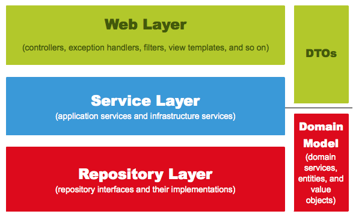

✍️ **TIL (2023-01-17)**
===  

</br>

## **1. 테스트 코드 작성**
- 견고한 서비스를 만들기 위해선 TDD를 하거나, 최소한 테스트 코드는 작성해야 한다.  

</br>

### **1) 테스트 코드**
- **TDD (Test Driven Development)** 란 **테스트 주도 개발** 을 말한다.
- TDD의 경우, 개발을 하기 전에 테스트 코드를 먼저 작성하는 것부터 시작한다.  
  
    - 항상 실패하는 테스트 코드를 먼저 작성한다. (Red)
    - 테스트가 통과하는 프로덕션 코드를 작성한다. (Green)
    - 테스트가 통과하면 프로덕션 코드를 리팩토링한다. (Refactor)  
- 반면, **단위 테스트**는 TDD의 첫 번째 단계인 '기능 단위의 테스트 코드를 작성하는 것'을 의미한다.  
(순수하게 테스트 코드만 작성하는 것을 말한다.)  

</br>

- 위와 같은 테스트 코드를 작성하는 이유는 다음과 같다.  
    - (단위 테스트는) 개발 단계 초기에 문제를 발견하게 도와준다.
    - 개발자가 나중에 코드를 리팩토링하거나 라이브러리 업그레이드 등에서 기존 기능이 올바르게 작동하는지 확인할 수 있다.  
    -  기능에 대한 불확실성을 감소시킬 수 있다.
    - 시스템에 대한 실제 문서를 제공한다. (즉, 단위 테스트 자체를 문서로 사용할 수 있다.)  

</br>

### **2) Hello Controller 테스트 코드 작성**  
- 메인 클래스 작성
    ```java
    package prac;

    import org.springframework.boot.SpringApplication;
    import org.springframework.boot.autoconfigure.SpringBootApplication;

    @SpringBootApplication
    public class Application {
        public static void main(String[] args) {
            SpringApplication.run(Application.class, args);
        }
    }
    ```  
    - `@SpringBootApplication` 어노테이션을 통해 스프링 부트, 스프링 빈 읽기와 생성 등이 자동으로 설정된다.
    - `@SpringBootApplication` 이 있는 위치부터 설정을 읽어가므로, 프로젝트의 최상단에 위치해야 한다.  
    - `main` 메소드 안에서 실행되는 `SpringApplication.run`으로 인해 내장 **WAS(웹 애플리케이션 서버)** 가 실행된다.
        - 내장 WAS란 별도로 외부에 WAS를 두지 않고 애플리케이션을 실행할 때 내부에서 WAS를 실행하는 것을 말한다.
        - 이렇게 되면 항상 서버에 톰캣(Tomcat)을 설치할 필요가 없게 되고, 스프링 부트로 만들어진 `jar` 파일로 실행하면 된다.  
        - 내장 WAS를 사용함으로써 언제 어디서나 같은 환경에서 스프링 부트를 배포할 수 있다.  

</br>

- 테스트를 위한 Controller 작성  
    ```java
    package prac.web;

    import org.springframework.web.bind.annotation.GetMapping;
    import org.springframework.web.bind.annotation.RestController;

    @RestController // JSON을 반환하는 컨트롤러로 만든다. ('@ResponseBody'를 각 메소드마다 선언하지 않아도 된다.)
    public class HelloController {

        // HTTP 메소드인 Get 요청을 받을 수 있는 API를 만들어 준다.
        @GetMapping("/hello")
        public String hello() {
            return "hello";
        }
    }
    ```  
- 테스트 코드 작성
    ```java
    package prac.web;

    import static org.springframework.test.web.servlet.result.MockMvcResultMatchers.content;
    import static org.springframework.test.web.servlet.result.MockMvcResultMatchers.status;
    import org.junit.jupiter.api.Test;
    import org.springframework.beans.factory.annotation.Autowired;
    import org.springframework.boot.test.autoconfigure.web.servlet.WebMvcTest;
    import org.springframework.test.web.servlet.MockMvc;
    import org.springframework.test.web.servlet.request.MockMvcRequestBuilders;
    import org.springframework.test.web.servlet.setup.MockMvcBuilders;

    @WebMvcTest(controllers = HelloController.class)
    class HelloControllerTest {

        @Autowired  HelloController helloController;

        @Test
        public void returnHello() throws Exception {
            MockMvc mockMvc = MockMvcBuilders.standaloneSetup(helloController).build();
            mockMvc.perform(MockMvcRequestBuilders.get("/hello"))
                    .andExpect(status().isOk())
                    .andExpect(content().string("hello"));
        
        }
    }
    ```  
    - `@WebMvcTest`
        - 선언할 경우 @Controller, @Controller 등을 사용할 수 있다.
        - 단, Service, @Component, @Repository 등은 사용할 수 없다.
        - '@WebMvcTest'를 사용하기 위해 테스트할 특정 컨트롤러 클래스를 명시할 수 있다.  
    - `MockMvc`
        - 웹 애플리케이션을 애플리케이션 서버에 배포하지 않고도 스프링 MVC의 동작을 재현할 수 있는 클래스이다.
        - 이 클래스를 통해 HTTP GET, POST 등에 대한 API 테스트를 할 수 있다.  
        - `MockMvcRequestBuilder` 클래스를 사용해 설정한 요청 데이터를 perform()의 인수로 전달한다.  
        - `get, post, put, delete, fileUpload` 와 같은 메서드를 제공하며, `ResultActions` 이라는 인터페이스를 반환한다.  
        - `ResultActions` 인터페이스는 `andDo(), andExpect(), andReturn()` 등의 메소드를 지원한다.  
    - `mockMvc.perform(get())` : MockMvc를 통해 해당 주소로 HTTP GET 요청을 보낸다.
    - `.andExpect(status().isOk())` : mvc.perform의 결과를 검증한다. (status → 200)  
    - `.andExpect(content().string("hello"))` : Controller가 리턴하는 값이 'hello'가 맞는지를 확인한다.


    </br>

    -  상단의 `@WebMvcTest` 어노테이션 없이 `@Autowired`를 통해 `HelloController`를 DI 받으려고 했더니 NPE가 발생했다.
    - 이러한 문제를 해결하기 위해선 위와 같이 `@WebMvcTest`를 작성하거나, 다음과 같은 어노테이션을 추가해줘야 한다.  
        ```java
        @RunWith(SpringRunner.class)
        @SpringBootTest
        ```  
    - `@RunWith()`
        - Spring 프레임워크의 실행 방법을 확장할 때 사용하는 어노테이션이다.
        - `SpringRunner` 라는 클래스를 지정해주면, JUnit 프레임워크가 내장된 Runner 를 실행할 때 `SpringRunner.class` 라는 확장된 클래스를 사용한다.  
    - `@SpringBootTest`  
        - 통합 테스트를 제공하는 기본적인 스프링 부트 테스트 어노테이션이다.
        - 스프링 부트 어플리케이션 테스트 시 테스트에 필요한 거의 모든 의존성을 제공한다.  
        - `@SpringBootApplication`을 찾아가 하위의 모든 스프링 빈을 스캔한 다음, 그 후 Test용 Application Context를 만들면서 빈을 등록해주고, mock bean을 찾아가 그 빈만 mock bean으로 교체한다.  

</br>

### **3) Lombok 설치**  
- **Lombok** : 자바 개발 시 자주 사용하는 코드인 Getter, Setter, 기본 생성자, toString 등을 어노테이션으로 자동으로 생성해 준다.  
- build.gradle 파일에 의존성 추가
    ```java
    implementation 'org.projectlombok:lombok'
    ```  
- `HelloResponseDto` 클래스 작성
    ```java
    package prac.web.dto;

    import lombok.Getter;
    import lombok.RequiredArgsConstructor;

    @Getter  // 선언된 모든 필드의 getter 생성한다.
    @RequiredArgsConstructor  // 선언된 모든 'final' 필드가 포함된 생성자를 생성한다.
    public class HelloResponseDto {
        private final String name;
        private final int amount;
    }
    ```  
- 테스트 코드 작성
    ```java
    package prac.web.dto;

    import org.junit.jupiter.api.Test;
    import static org.assertj.core.api.Assertions.*;

    public class HelloResponseDtoTest {
        @Test
        public void testLombok() {
            // given
            String name = "test";
            int amount = 1000;

            // when
            HelloResponseDto dto = new HelloResponseDto(name, amount);

            // then
            assertThat(dto.getName()).isEqualTo(name);
            assertThat(dto.getAmount()).isEqualTo(amount);
        }
    }
    ```  
    - `assertThat`  
        - 'assertj'라는 테스트 검증 라이브러리의 검증 메소드이다.  
        - 메소드 체이닝이 지원되어 `isEqualTo`와 같이 메소드를 이어서 사용할 수 있다.

</br>

- 테스트 코드 실행 시 `variable not initialized in the default constructor` 에러가 발생했는데, 이는 Gradle 버전이 올라가면서 Lombok 의존성을 추가하는 방법이 바뀌었기 때문에 발생하는 문제라고 한다.
- 위의 의존성 추가 방법을 다음과 같이 수정했더니 정상적으로 테스트를 통과하였다.  
    ```gradle
    // Gradle 5.0 이상
    dependencies {
        compileOnly 'org.projectlombok:lombok'
        annotationProcessor 'org.projectlombok:lombok'
    }
    ```  

</br>

- `HelloController`에 `ResponseDto`를 사용하도록 코드 추가  
    ```java
    package prac.web;

    import org.springframework.web.bind.annotation.GetMapping;
    import org.springframework.web.bind.annotation.RequestParam;
    import org.springframework.web.bind.annotation.RestController;
    import prac.web.dto.HelloResponseDto;

    @RestController
    public class HelloController {

        @GetMapping("/hello")
        public String hello() {
            return "hello";
        }

        @GetMapping("/hello/dto")
        public HelloResponseDto helloResponseDto(@RequestParam("name") String name, @RequestParam("amount") int amount) {
            return new HelloResponseDto(name, amount);
        }
    }
    ```  
    - `@RequestParam`
        - 외부에서 API로 넘긴 파라미터를 가져오는 어노테이션이다.  
        - 외부에서 name (`@RequestParam("name)`)이란 이름으로 넘긴 파라미터가 메소드 파라미터 name (`String name`)에 저장된다.  

</br>

- `HelloControllerTest` 클래스 코드 추가 및 수정
    ```java
    package prac.web;

    import static org.springframework.test.web.servlet.request.MockMvcRequestBuilders.get;

    import org.junit.jupiter.api.Test;
    import org.junit.runner.RunWith;
    import org.springframework.beans.factory.annotation.Autowired;
    import org.springframework.boot.test.autoconfigure.web.servlet.WebMvcTest;
    import org.springframework.test.context.junit4.SpringRunner;
    import org.springframework.test.web.servlet.MockMvc;
    import static org.springframework.test.web.servlet.result.MockMvcResultMatchers.*;

    @RunWith(SpringRunner.class)
    @WebMvcTest
    class HelloControllerTest {

        @Autowired MockMvc mvc;

        @Test
        public void returnHello() throws Exception {
            mvc.perform(get("/hello"))
                    .andExpect(status().isOk())
                    .andExpect(content().string("hello"));
        }

        @Test
        public void returnHelloDto() throws Exception {
            String name = "hello";
            int amount = 1000;

            mvc.perform(get("/hello/dto")
                            .param("name", name)
                            .param("amount", String.valueOf(amount)))
                    .andExpect(status().isOk())
                    .andExpect(jsonPath("$.name").value("hello"))
                    .andExpect(jsonPath("$.amount").value(1000));

        }
    }
    ```  
    - `param` : API 테스트를 할 때 사용할 요청 파라미터를 설정한다. (값으로는 `String`만 가능)  
    - `jsonPath`  
        - JSON 응답값을 필드별로 검증할 수 있는 메소드이다.
        - `$`을 기준으로 필드명을 명시한다.  

</br>

## **2. 스프링 부트에서 JPA로 데이터베이스 다뤄보기**  

</br>

### **1) JPA**  
- **문제**  
    - **단순 반복 작업 (SQL)**
        - 현대의 웹 애플리케이션에서 관계형 데이터베이스는 빠질 수 없는 요소이므로, 자바의 객체를 RDB에서 관리할 수 있어야 한다.
        - 이때, Oracle, MySQL과 같은 RDB는 SQL을 사용하기 때문에, 각 테이블마다 기본적인 CRUD SQL을 매번 생성해 주어야 한다.
        - 수십, 수백 개의 테이블을 관리해야 하는 실무에서 위와 같은 단순 반복 작업은 매우 비효율적일 수 있다.  
    - **패러다임의 불일치**
        - 관계형 데이터베이스는 어떻게 데이터를 저장할지에 초점이 맞춰진 기술이지만, 객체지향 프로그래밍 언어는 기능과 속성을 한 곳에서 관리하는 기술이다.  
        - 관계형 데이터베이스와 객체지향 프로그래밍 언어의 패러다임이 서로 다른데, 객체를 DB에 저장하려고 하니 여러 문제가 발생한다.  
        - 이를 **패러다임의 불일치** 라고 한다.  
        - 예를 들어 객체지향 프로그래밍에서는 다음과 같이 부모-자식 클래스 관계를 통해 부모 객체를 가져올 수 있지만,  
            ```java
            User user = findUser();
            Group group = user.getGroup();
            ```  
        - RDB가 포함될 경우 User 따로, Group 따로 조회해야 하고, User와 Group이 어떤 관계인지 알기가 어려워진다.  
            ```java
            User user = userDao.findUser();
            Group group = groupDao.findGroup(user.getGroupId());
            ```  
        - 이처럼 상속과 같은 다양한 객체 모델링은 데이터베이스로 구현하기가 어려우므로, 웹 애플리케이션 개발이 점점 데이터 베이스 모델링에 집중하게 되는 문제가 생기게 된다.  

</br>

- **JPA** 는 위와 같은 문제를 해결하기 위해 등장한 기술이다.
    - 자바와 같은 객체지향 프로그래밍(OOP) 언어와 관계형 데이터베이스를 **중간에서 패러다임 일치** 시켜주기 위한 기술이다.  
    - 즉, 개발자가 **객체 지향적으로 프로그래밍** 을 하면, JPA가 관계형 데이터베이스에 맞게 SQL을 대신 생성해서 실행해준다.  
    - 덕분에 개발자가 더 이상 SQL에 종속적인 개발을 하지 않을 수 있다.  
    - 객체 중심으로 개발을 하게 되니 생산성 향상을 물론, 유지 보수하기가 정말 편해진다.  

</br>

- **Spring Data JPA**  
    - JPA는 인터페이스로서 자바 표준 명세서이다.  
    - 인터페이스인 JPA를 사용하기 위해서는 구현체가 필요한데, JPA의 대표적인 구현체로는 Hibernate, Eclipse Link 등이 있다.  
    - 스프링에서 JPA를 사용할 때는 이 구현체들을 직접 다루진 않고, 이 구현체들을 좀 더 쉽게 사용하고자 추상화시킨 **Spring Data JPA** 라는 모듈을 사용하여 JPA 기술을 다룬다.  
        ```java
        JPA <- Hibernate <- Spring Data JPA
        ```
    - Hibernate과 Spring Data JPA를 쓰는 것 사이에는 큰 차이가 없지만, 스프링에서는 Spring Data JPA 사용을 권장하고 있다.  
        - 그 이유는 첫 번째로 **구현체 교체의 용이성** 이다.
        - Spring Data JPA 내부에서 구현체 매핑을 지원하기 때문에 Hibernate 외에 다른 구현체로 쉽게 교체할 수 있다.  
        - 두 번째로는 **저장소 교체의 용이성** 이다.  
        - 저장소 교체의 용이성은 관계형 데이터베이스 외에 다른 저장소로 쉽게 교체할 수 있는 것을 말한다.  
        - 트래픽이 많아져 관계형 데이터베이스로 도저히 감당이 되지 않을 때, MongoDB 등으로의 교체가 필요하다면 Spring Data JPA에서 Spring Data MongoDB로 의존성만 교체하면 된다. 

</br>

### **2) 프로젝트에 Spring Data JPA 적용**  
- `build.gradle` 설정
    ```gradle
    dependencies {
        // ...
        implementation 'org.springframework.boot:spring-boot-starter-data-jpa'
        implementation 'mysql:mysql-connector-java'
    }
    ```  
    - `spring-boot-starter-data-jpa`  
        - 스프링 부트용 Spring Data JPA 추상화 라이브러리이다.
        - 스프링 부트 버전에 맞춰 자동으로 JPA 관련 라이브러리들의 버전을 관리해준다.
    - ※ 책에서는 H2 데이터베이스를 사용했지만, 나는 Mysql을 사용하기로 했다.  
- `application.properties` 설정
    ```properties
    # MySQL 설정
    spring.datasource.driver-class-name=com.mysql.cj.jdbc.Driver
    
    # DB Source URL
    spring.datasource.url=jdbc:mysql://<IP>:<Port/<DB>?useSSL=false&useUnicode=true&serverTimezone=Asia/Seoul
    
    # DB username
    spring.datasource.username=<username>
    
    # DB password
    spring.datasource.password=<password>
    
    # true 설정시 JPA 쿼리문 확인 가능
    spring.jpa.show-sql=true
    
    # DDL(create, alter, drop) 정의시 DB의 고유 기능을 사용할 수 있다.
    spring.jpa.hibernate.ddl-auto=update
    
    # JPA의 구현체인 Hibernate가 동작하면서 발생한 SQL의 가독성을 높여준다.
    spring.jpa.properties.hibernate.format_sql=true
    ```  


</br>

- `Posts` 클래스 작성  
    ```java
    package prac.domain.posts;

    import jakarta.persistence.*;
    import lombok.Builder;
    import lombok.Getter;
    import lombok.NoArgsConstructor;

    @Getter
    @NoArgsConstructor
    @Entity
    public class Posts {
        @Id
        @GeneratedValue(strategy = GenerationType.IDENTITY)
        private long id;

        @Column(length = 500, nullable = false)
        private String title;

        @Column(columnDefinition = "TEXT", nullable = false)
        private String content;

        private String author;

        @Builder
        public Posts(String title, String content, String author) {
            this.title = title;
            this.content = content;
            this.author = author;
        }
    }
    ```  
    - `domain` : 게시글, 댓글, 회원, 정산, 결제 등 소프트웨어에 대한 요구사항 혹은 문제 영역인 도메인을 담을 패키지  
    - `Posts` : 실제 DB 테이블과 매칭될 클래스로, Entity 클래스라고도 한다.  

    </br>

    - JPA에서 제공하는 어노테이션
        - `@Entity` 
            - DB 테이블과 링크될 클래스임을 나타낸다.  
            - 기본 값으로 클래스의 카멜케이스 이름을 언더스코어 네이밍(_)으로 테이블 이름을 매칭한다.  
            (ex SalesManager.java → sales_manager table)  
        - `@Id` : 해당 테이블의 PK 필드를 나타낸다.  
        - `@GeneratedValue`  
            - PK 생성 규칙을 나타낸다.  
            - `GenerationType.IDENTITY` :  id 값을 null로 하면 DB가 알아서 AUTO_INCREMENT 해준다.  
        - `@Column`  
            - 테이블의 Column을 나타내며, 굳이 선언하지 않더라도 해당 클래스의 필드는 모두 Column이 된다.  
            - 주로 디폴트 옵션 외에 추가로 변경이 필요한 옵션이 있을 때 사용한다.  
    - 롬복 라이브러리의 어노테이션  
        - `@NoArgsConstructor` : 디폴트 생성자를 자동으로 추가해준다.  
        - `@Getter` : 클래스 내 모든 필드의 Getter 메소드를 자동으로 생성해준다.  
        - `@Builder`  
            - 해당 클래스의 빌더 패턴 클래스를 생성한다.  
            - 생성자 상단에 선언 시 생성자에 포함된 필드만 빌더에 포함된다.  
            - 빌더를 사용하게 되면 어느 필드에 어떤 값을 채워야 할지 명확하게 인지할 수 있다.  
    
    </br>  

    - Entity 클래스에서는 Setter 메소드를 만들지 않는다.  
        - 대신 해당 필드의 값 변경이 필요하면 명확히 그 목적과 의도를 나타낼 수 있는 메소드를 추가한다.  
            ```java
            // setter 사용
            public class Order {
                public void setStatus(boolean status) {
                    this.status = status;
                }
            }

            public void cancelOrderEvent() {
                order.setStatus(false);
            }  

            // 목적과 의도를 나타낼 수 있는 메소드 사용
            public class Order {
                public void cancelOrder() {
                    this.status = false;
                }
            }

            public void cancelOrderEvent() {
                order.cancelOrder();
            }
            ```  
        - 생성자를 통해 최종 값을 채운 후 DB에 삽입한 다음, 위와 같이 해당 이벤트에 맞는 public 메소드를 호출하여 변경한다.  

</br>

- `Posts` 클래스로 DB를 접근하게 해줄 JpaRepository 생성 (`PostsRepository` 인터페이스)  
    ```java
    package prac.domain.posts;

    import org.springframework.data.jpa.repository.JpaRepository;

    public interface PostsRepository extends JpaRepository<Posts, Long> {
    }
    ```  
    - 인터페이스 생성 후 `JpaRepository<Entity 클래스, PK 타입>`을 상속하면 기본적인 CRUD 메소드가 자동으로 생성된다.  
    - Entity 클래스와 기본 Entity Repository는 함께 위치해야 한다.  
    (Entity 클래스는 기본 Repository 없이는 제대로 역할을 할 수가 없다.)  
    - 도메인별로 프로젝트를 분리해야 한다면 Entity 클래스와 기본 Repository는 도메인 패키지에서 함께 관리한다.

</br>  

- 테스트 코드 작성
    ```java
    package prac.domain.posts;

    import static org.assertj.core.api.Assertions.*;
    import org.junit.jupiter.api.AfterEach;
    import org.junit.jupiter.api.Test;
    import org.junit.runner.RunWith;
    import org.springframework.beans.factory.annotation.Autowired;
    import org.springframework.boot.test.context.SpringBootTest;
    import org.springframework.test.context.junit4.SpringRunner;

    import java.util.List;

    @RunWith(SpringRunner.class)
    @SpringBootTest
    class PostsRepositoryTest {

        @Autowired
        PostsRepository postsRepository;

        @AfterEach
        public void cleanup() {
            postsRepository.deleteAll();
        }

        @Test
        public void 게시글저장_불러오기() {
            //given
            String title = "테스트 게시글";
            String content = "테스트 본문";

            postsRepository.save(Posts.builder()
                    .title(title)
                    .content(content)
                    .author("sample123@gmail.com").
                    build());

            // when
            List<Posts> postsList = postsRepository.findAll();

            // then
            Posts posts = postsList.get(0);
            assertThat(posts.getTitle()).isEqualTo(title);
            assertThat(posts.getContent()).isEqualTo(content);
        }
    }
    ```  
    - `@AfterEach`  
        - 단위 테스트가 끝날 때마다 수행되는 메소드를 지정한다.  
        - 보통은 배포 전 전체 테스트를 수행할 때 테스트 간 데이터 침범을 막기 위해 사용한다.  
    - `postsRepository.save`  
        - 테이블 `posts`에 insert/update 쿼리를 실행한다.
        - id 값이 있다면 update가, 없다면 insert 쿼리가 실행된다.  
    - 테스트 코드 실행 시 정상적으로 테스트를 통과했다.  

</br>  

### **3) 등록/수정/조회 API 만들기**  
- API를 만들기 위해서는 총 3개의 클래스가 필요하다.  
    - Request 데이터를 받을 Dto
    - API 요청을 받을 Controller
    - 트랜잭션, 도메인 기능 간의 순서를 보장하는 Service  

- Spring Web 계층  
      
    - **Web Layer**
        - 컨트롤러(`@Controller`)와 JSP/Freemarker 등의 뷰 템플릿 영역이다.  
        - 이외에도 필터(`@Filter`), 인터셉터, 컨트롤러 어드바이스(`@ControllerAdvice`) 등의 외부 요청과 응답에 대한 전반적인 영역을 말한다.  
    - **Service Layer**  
        - `@Service`에 사용되는 서비스 영역이다.  
    - **Repository Layer**  
        - Database와 같이 데이터 저장소에 접근하는 영역이다.  
    - **Dtos** 
        - Dto(Data Transfer Object)는 계층 간의 데이터 교환을 위한 객체를 말하며, Dtos는 이들의 영역을 의미한다.  
        - 뷰 템플릿 엔진에서 사용될 객체나 Repository Layer에서 결과로 넘겨준 객체 등이 있다.  
    - **Domain Model**  
        - 도메인이라 불리는 개발 대상을 모든 사람이 동일한 관점에서 이해할 수 있고 공유할 수 있도록 단순화시킨 것을 말한다.  
        - 이를테면 택시 앱이라고 하면 배차, 탑승, 요금 등이 모두 도메인이 될 수 있다.  
        - `@Entity`가 사용된 영역 역시 도메인 모델이라고 볼 수 있다.  
        - 다만 무조건 데이터베이스의 테이블과 관계가 있어야만 하는 것은 아니며, VO처럼 값 객체들도 이 영역에 해당한다.  
    
    </br>  
    
    - 위의 5가지 Layer에서 비즈니스 처리를 담당해야 할 곳은 Domain이다.  
    - 기존에 서비스로 처리하던 방식을 **트랜잭션 스크립트** 라고 한다.  
    - 모든 로직이 서비스 클래스 내부에서 처리되다 보니, 서비스 계층이 무의미하며, 객체가 단순히 데이터 덩어리 역할만 하게 된다.  
    - 반면 도메인 모델의 경우, 서비스 메소드는 트랜잭션과 도메인 간의 순서만 보장해준다.  

</br>  

- `PostsApiController` 클래스 생성  
    ```java
    package prac.web;

    import lombok.RequiredArgsConstructor;
    import org.springframework.web.bind.annotation.PostMapping;
    import org.springframework.web.bind.annotation.RequestBody;
    import org.springframework.web.bind.annotation.RestController;
    import prac.service.PostsService;
    import prac.web.dto.PostsSaveRequestDto;

    @RequiredArgsConstructor
    @RestController
    public class PostsApiController {

        private final PostsService postsService;

        @PostMapping("/api/v1/posts")
        public Long save(@RequestBody PostsSaveRequestDto requestDto) {
            return postsService.save(requestDto);
        }
    }
    ```  
- `PostsService` 클래스 생성
    ```java
    package prac.service;

    import lombok.RequiredArgsConstructor;
    import org.springframework.stereotype.Service;
    import org.springframework.transaction.annotation.Transactional;
    import prac.domain.posts.PostsRepository;
    import prac.web.dto.PostsSaveRequestDto;

    @RequiredArgsConstructor  
    @Service
    public class PostsService {
        private final PostsRepository postsRepository;

        @Transactional
        public Long save(PostsSaveRequestDto requestDto) {
            return postsRepository.save(requestDto.toEntity()).getId();
        }
    }
    ```  
    - `@RequiredArgsConstructor`는 `final`로 선언된 모든 필드를 인자값으로 하는 생성자를 만들어 준다.
    - 이 생성자를 통해 `PostRepository`에 관한 스프링 빈 객체를 DI 받을 수 있다. (생성자 주입)  
    - 직접 생성자를 쓰지 않고 lombok 어노테이션을 사용하면 해당, 클래스의 의존성 관계가 변경될 때마다 생성자 코드를 계속해서 수정하지 않아도 된다.  

</br>

- `PostsSaveRequestDto` 클래스 생성  
    ```java
    package prac.web.dto;

    import lombok.Builder;
    import lombok.Getter;
    import lombok.NoArgsConstructor;
    import prac.domain.posts.Posts;

    @Getter
    @NoArgsConstructor
    public class PostsSaveRequestDto {
        private String title;
        private String content;
        private String author;

        @Builder

        public PostsSaveRequestDto(String title, String content, String author) {
            this.title = title;
            this.content = content;
            this.author = author;
        }

        public Posts toEntity() {
            return Posts.builder()
                    .title(title)
                    .content(content)
                    .author(author)
                    .build();
        }
    }
    ```    
    - 절대로 Entity 클래스를 Request/Response 클래스로 사용해서는 안 된다.  
    - Entity 클래스는 데이터베이스와 맞닿은 핵심 클래스로, Entity 클래스를 기준으로 테이블이 생성되고, 스키마가 변경된다.  
    - 화면 변경은 사소한 기능 변경인데, 이를 위해 테이블과 연결된 Entity 클래스를 변경하는 것은 오버헤드가 크다.
    - 때문에 Entity 클래스와 Controller에서 쓸 Dto는 분리해서 사용해야 한다.  
    (View Layer와 DB Layer의 역할 분리는 철저하게 하는 게 좋다.)  

</br>

- 테스트 코드 생성 (`PostsApiControllerTest` 클래스)
    ```java
    package prac.web;

    import org.junit.jupiter.api.AfterEach;
    import org.junit.jupiter.api.Test;
    import org.springframework.beans.factory.annotation.Autowired;
    import org.springframework.boot.test.context.SpringBootTest;
    import org.springframework.boot.test.web.client.TestRestTemplate;
    import org.springframework.boot.test.web.server.LocalServerPort;
    import org.springframework.http.HttpStatus;
    import org.springframework.http.ResponseEntity;
    import prac.domain.posts.Posts;
    import prac.domain.posts.PostsRepository;
    import prac.web.dto.PostsSaveRequestDto;

    import java.util.List;

    import static org.assertj.core.api.Assertions.*;

    @SpringBootTest(webEnvironment = SpringBootTest.WebEnvironment.RANDOM_PORT)
    class PostsApiControllerTest {
        @LocalServerPort
        private int port;

        @Autowired
        private TestRestTemplate restTemplate;

        @Autowired
        private PostsRepository postsRepository;

        @AfterEach
        public void tearDown() throws Exception {
            postsRepository.deleteAll();
        }

        @Test
        public void Posts_등록된다() throws Exception {
            // given
            String title = "title";
            String content = "content";
            PostsSaveRequestDto requestDto = PostsSaveRequestDto.builder()
                    .title(title)
                    .content(content)
                    .author("author")
                    .build();

            String url = "http://localhost:" + port + "/api/v1/posts";

            // when
            ResponseEntity<Long> responseEntity = restTemplate.postForEntity(url, requestDto, Long.class);

            // then
            assertThat(responseEntity.getStatusCode()).isEqualTo(HttpStatus.OK);
            assertThat(responseEntity.getBody()).isGreaterThan(0L);

            List<Posts> all = postsRepository.findAll();
            assertThat(all.get(0).getTitle()).isEqualTo(title);
            assertThat(all.get(0).getContent()).isEqualTo(content);
        }
    }
    ```  
    - `@WebMvcTest`의 경우 JPA 기능이 작동하지 않으므로, 지금 같이 JPA 기능까지 한번에 테스트할 때에는 `@SpringBootTest`와 `TestRestTemplate`을 사용하면 된다.  

</br>

- `PostsApiController` 클래스 수정  
    ```java
    package prac.web;

    import lombok.RequiredArgsConstructor;
    import org.springframework.web.bind.annotation.*;
    import prac.service.PostsService;
    import prac.web.dto.PostsResponseDto;
    import prac.web.dto.PostsSaveRequestDto;
    import prac.web.dto.PostsUpdateRequestDto;

    @RequiredArgsConstructor
    @RestController
    public class PostsApiController {

        //... 

        @PutMapping("/api/v1/posts/{id}")
        public Long update(@PathVariable Long id, @RequestBody PostsUpdateRequestDto requestDto) {
            return postsService.update(id, requestDto);
        }

        @GetMapping("/api/v1/posts/{id}")
        public PostsResponseDto findById (@PathVariable Long id) {
            return postsService.findById(id);
        }
    }
    ```  
- `PostsResponseDto` 클래스 생성
    ```java
    package prac.web.dto;

    import prac.domain.posts.Posts;

    public class PostsResponseDto {
        private Long id;
        private String title;
        private String content;
        private String author;

        public PostsResponseDto(Posts entity) {
            this.id = entity.getId();
            this.title = entity.getTitle();
            this.content = entity.getContent();
            this.author = entity.getAuthor();
        }
    }
    ```  
- `PostsUpdateRequestBto` 클래스 생성  
    ```java
    package prac.web.dto;

    import lombok.Builder;
    import lombok.Getter;
    import lombok.NoArgsConstructor;

    @Getter
    @NoArgsConstructor
    public class PostsUpdateRequestDto {
        private String title;
        private String content;

        @Builder

        public PostsUpdateRequestDto(String title, String content) {
            this.title = title;
            this.content = content;
        }
    }
    ```  
- `Posts` 클래스 수정  
    ```java
    public class Posts {

        // ...

        public void update(String title, String content) {
            this.title = title;
            this.content = content;
        }
    }
    ```  
- `PostsService` 클래스 수정  
    ```java
    @RequiredArgsConstructor
    @Service
    public class PostsService {

        // ...

        @Transactional
        public Long update(Long id, PostsUpdateRequestDto requestDto) {
            Posts posts = postsRepository.findById(id)
                    .orElseThrow(() -> new IllegalArgumentException("해당 게시글이 없습니다. id=" + id));
            posts.update(requestDto.getTitle(), requestDto.getContent());
            return id;
        }

        public PostsResponseDto findById(Long id) {
            Posts entity = postsRepository.findById(id)
                    .orElseThrow(() -> new IllegalArgumentException("해당 게시글이 없습니다. id=" + id));
            return new PostsResponseDto(entity);
        }
    }
    ```  
    - `update` 기능에서 데이터베이스에 쿼리를 날리는 부분이 없는데, 이는 JPA의 **영속성 컨텍스트** 때문이다.  
    - 영속성 컨텍스트란 엔티티를 영구적으로 저장하는 환경이다.
    - 일종의 논리적 개념이며, JPA의 핵심 내용은 엔티티가 영속성 컨텍스트에 포함되어 있는지 아닌지로 갈린다.  
    - JPA의 엔티티 매니저(Entity Manager)가 활성화된 상태로(Spring Data JPA를 쓴다면 기본 옵션) 트랜잭션 안에서 데이터베이스에서 데이터를 가져오면 이 데이터는 영속성 컨텍스트에 유지된 상태이다.  
    - 이 상태에서 해당 데이터의 값을 변경하면 트랜잭션이 끝나는 시점에 해당 테이블에 변경분을 반영한다.  
    - 즉, Entity 객체의 값만 변경하면 별도로 Update 쿼리를 날릴 필요가 없다.  
    - 이를 **더티 체킹(Dirty Checking)** 이라고 한다.  

