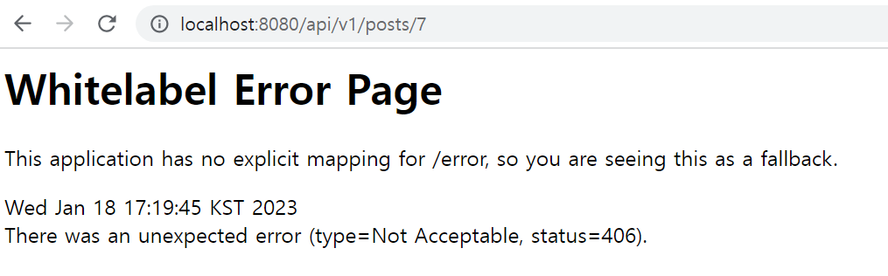
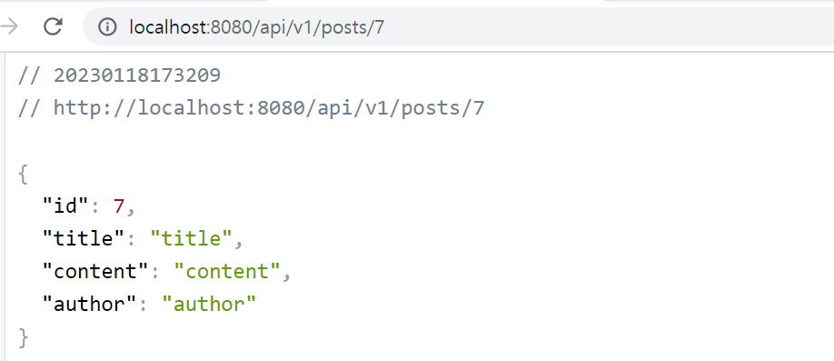
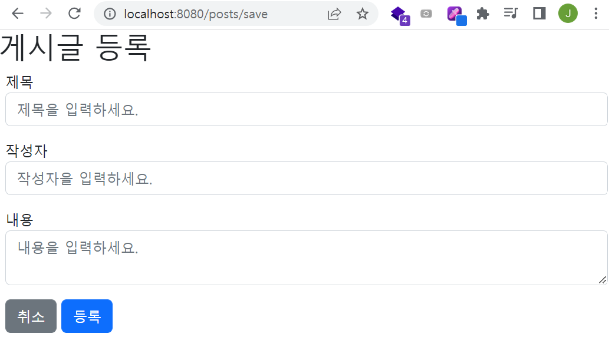
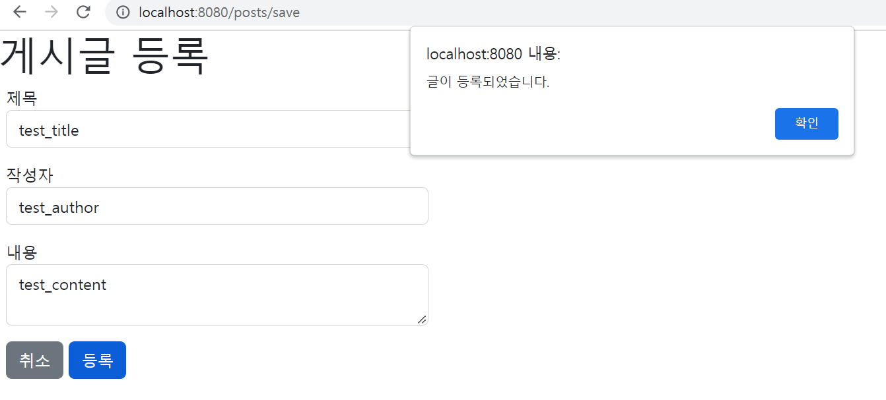
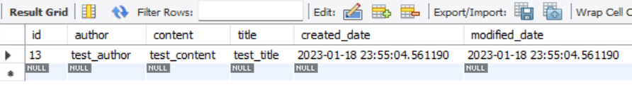
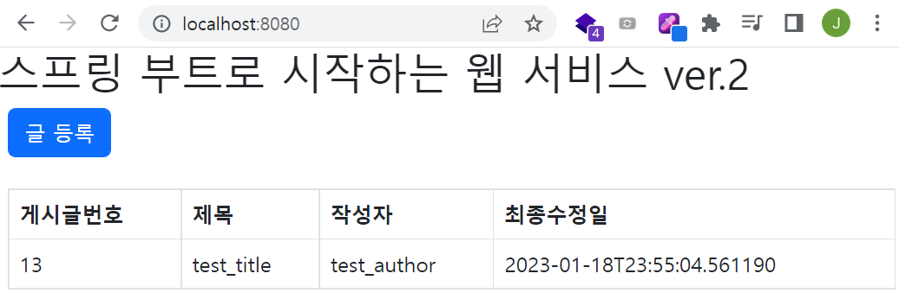

✍️ **TIL (2023-01-18)**
===  

</br>

## **1. 스프링 부트에서 JPA로 데이터베이스 다루기**

- 테스트 코드 작성 (`PostsApiControllerTest` 클래스)
    ```java
    package prac.web;

    import org.junit.jupiter.api.AfterEach;
    import org.junit.jupiter.api.Test;
    import org.springframework.beans.factory.annotation.Autowired;
    import org.springframework.boot.test.context.SpringBootTest;
    import org.springframework.boot.test.web.client.TestRestTemplate;
    import org.springframework.boot.test.web.server.LocalServerPort;
    import org.springframework.http.HttpEntity;
    import org.springframework.http.HttpMethod;
    import org.springframework.http.HttpStatus;
    import org.springframework.http.ResponseEntity;
    import prac.domain.posts.Posts;
    import prac.domain.posts.PostsRepository;
    import prac.web.dto.PostsSaveRequestDto;
    import prac.web.dto.PostsUpdateRequestDto;

    import java.util.List;

    import static org.assertj.core.api.Assertions.*;

    @SpringBootTest(webEnvironment = SpringBootTest.WebEnvironment.RANDOM_PORT)
    class PostsApiControllerTest {
 
        // ...

        @Test
        public void Posts_수정된다() throws Exception {
            // given
            Posts savedPosts = postsRepository.save(Posts.builder()
                    .title("title")
                    .content("content")
                    .author("author")
                    .build());

            Long updateId = savedPosts.getId();
            String expectedTitle = "title2";
            String expectedContent = "content2";

            PostsUpdateRequestDto requestDto = PostsUpdateRequestDto.builder()
                    .title(expectedTitle)
                    .content(expectedContent)
                    .build();

            String url = "http://localhost:" + port + "/api/v1/posts/" + updateId;

            HttpEntity<PostsUpdateRequestDto> requestEntity = new HttpEntity<>(requestDto);

            // when
            ResponseEntity<Long> responseEntity = restTemplate.exchange(url, HttpMethod.PUT, requestEntity, Long.class);

            // then
            assertThat(responseEntity.getStatusCode()).isEqualTo(HttpStatus.OK);
            assertThat(responseEntity.getBody()).isGreaterThan(0L);

            List<Posts> all = postsRepository.findAll();
            assertThat(all.get(0).getTitle()).isEqualTo(expectedTitle);
            assertThat(all.get(0).getContent()).isEqualTo(expectedContent);
        }
    }
    ```  

</br>

- 우선 DB에 아래의 샘플 데이터를 저장하고, 브라우저에 `http://localhost:8080/api/v1/posts/7` 을 입력해 API 조회 기능을 테스트 했는데...
    ```json
    {
        "id": 7,
        "title": "title",
        "content": "content",
        "author": "author"
    }
    ```  

</br>

- `HttpMediaTypeNotAcceptableException` 에러가 발생했고, HTTP 응답은 406번이 왔다.   
    - `HttpMediaTypeNotAcceptableException` 에러는 요청 핸들러가 허용된 응답을 만들어낼 수 없을 때 발생하는 에러이다.
    - 여기서 허용된 응답이란 헤더에 정해놓은 허용 타입을 말한다.  
    - 406 에러도 마찬가지로 서버가 허용된 타입의 응답을 생성하지 못할 때 발생하는 통신 에러를 의미한다.  
    - DTO에서 Getter가 없으면 응답 내용에 값이 포함되지 않는 문제가 발생하므로, `PostsResponseDto`에 `@Getter` 어노테이션을 추가했더니 이제는 정상적으로 결과가 출력되었다.  
      
      
    
</br>

### **1) JPA Auditing으로 생성 시간/수정 시간 자동화하기**  
- JPA를 사용하여 도메인을 관계형 데이터베이스 테이블에 매핑할 때, 공통적으로 도메인들이 가지고 있는 필드나 컬럼들이 존재한다.
- 대표적으로는 생성일자, 수정일자, 식별자 같은 필드 및 컬럼이 있다. (유지보수에 있어 중요한 데이터들이다.)  
- 도메인마다 공통으로 존재한다는 의미는 곧 결국 코드가 중복된다는 말과 같다.  
- 그래서 JPA에서는 **Audit** 이라는 기능을 제공한다.  
- Audit은 감시하다, 감사하다라는 뜻으로 Spring Data JPA에서 시간에 대해서 자동으로 값을 넣어주는 기능이다.  
- 도메인을 영속성 컨텍스트에 저장하거나 조회를 수행한 후에 update를 하는 경우, 매번 시간 데이터를 입력하여 주어야 하는데, audit을 이용하면 자동으로 시간을 매핑하여 데이터베이스의 테이블에 넣어주게 된다.  

</br>

- `BaseTimeEntity` 클래스 작성  
    ```java
    package prac.domain;
    package prac.domain;

    import jakarta.persistence.EntityListeners;
    import jakarta.persistence.MappedSuperclass;
    import lombok.Getter;
    import org.springframework.data.annotation.CreatedDate;
    import org.springframework.data.annotation.LastModifiedDate;
    import org.springframework.data.jpa.domain.support.AuditingEntityListener;

    import java.time.LocalDateTime;

    @Getter
    @MappedSuperclass
    @EntityListeners(AuditingEntityListener.class)
    public class BaseTimeEntity {
        @CreatedDate
        private LocalDateTime createdDate;

        @LastModifiedDate
        private LocalDateTime modifiedDate;
    }
    ```  
    - `BaseTimeEntity` 클래스는 모든 Entity의 상위 클래스가 되어 Entity들의 생성일자, 수정일자를 관리하는 역할을 한다.
    - `@MappedSuperclass` : JPA Entity 클래스들이 해당 어노테이션이 붙은 클래스를 상속할 경우 해당 클래스의 필드들도 컬럼으로 인식한다.
    - `@EntityListeners(AuditingEntityListener.class)` : 해당 어노테이션이 붙은 클래스에 Auditing 기능을 포함시킨다.  
    - `@CreatedDate` : Entity가 생성되어 저장될 때 시간이 자동으로 저장된다.
    - `@LastModifiedEntity` : 조회한 Entity의 값을 변경할 때 시간이 자동으로 저장된다.  

</br>

- `Posts` 클래스가 `BaseTimeEntity`를 상속받도록 변경한다.  
    ```java
    public class Posts extends BaseTimeEntity {
        // ...
    }
    ```  
- JPA Auditing 어노테이션들을 모두 활성화할 수 있도록 `Application` 클래스에 활성화 어노테이션을 추가한다.  
    ```java
    package prac;

    import org.springframework.boot.SpringApplication;
    import org.springframework.boot.autoconfigure.SpringBootApplication;
    import org.springframework.data.jpa.repository.config.EnableJpaAuditing;

    @EnableJpaAuditing  // JPA Auditing 활성화
    @SpringBootApplication
    public class Application {
        public static void main(String[] args) {
            SpringApplication.run(Application.class, args);
        }
    }
    ```  

</br>  

- JPA Auditing 테스트 코드 추가 (`PostsRepositoryTest` 클래스)  
    ```java
    @Test
    public void BaseTimeEntity_등록() {
        // given
        LocalDateTime now = LocalDateTime.of(2023,1,18,19,30,0);
        postsRepository.save(Posts.builder()
                .title("title")
                .content("content")
                .author("author")
                .build());

        // when
        List<Posts> postsList = postsRepository.findAll();

        // then
        Posts posts = postsList.get(0);

        System.out.println(">>>>>>>>> createDate=" + posts.getCreatedDate() + ", modifiedDate=" + posts.getModifiedDate());
        assertThat(posts.getCreatedDate()).isAfter(now);
        assertThat(posts.getModifiedDate()).isAfter(now);
    }
    ```  
    ```
    >>>>>>>>> createDate=2023-01-18T19:33:02.121847, modifiedDate=2023-01-18T19:33:02.121847
    ```  
    - `BaseTimeEntity` 클래스만 상속받으면 되므로, 앞으로 추가될 엔티티들은 더 이상 등록일/수정일로 고민할 필요가 없다.  

</br>

## **2. 머스테치(Mustache)로 화면 구성하기**  

</br>

### **1) 서버 템플릿 엔진과 머스테치(Mustache)**  
- 웹 개발에서 **템플릿 엔진(Template Engine)** 이란 지정된 템플릿 양식과 데이터가 합쳐져 HTML 문서를 출력하는 소프트웨어를 말한다.  
- 자바 진영에서는 JSP, Thymeleaf, Velocity, Freemarker 등 다양한 서버 템플릿 엔진이 존재한다.
- 머스테치는 수많은 언어를 지원하는 가장 심플한 템플릿 엔진으로, 스프링 부트에서 공식으로 지원하는 템플릿 엔진이다.  
- 머스테치의 장점은 다음과 같다.  
    - 문법이 다른 템플릿 엔진보다 심플하다.  
    - 로직 코드를 사용할 수 없어 View의 역할과 서버의 역할이 명확하게 분리된다.  
    - Mustache.js와 Mustache.java 2가지가 다 있어서, 하나의 문법으로 클라이언트/서버 템플릿을 모두 사용할 수 있다.  

</br>

- 우선 mustache 플러그인을 설치 후 재시작한다. (Handlebars/Mustache)  
- 머스테치 스타터 의존성을 `build.gradle` 파일에 추가한다.  
    ```java
    implementation 'org.springframework.boot:spring-boot-start-mustache'
    ```  

</br>


- `index.mustache` 파일 생성  
    ```html
    <!DOCTYPE>
    <html>
    <head>
        <title>스프링 부트 웹 서비스</title>
        <meta http-equiv="Content-Type" content="text/html; charset=UTF-8" />
    </head>
    <body>
        <h1>스프링 부트로 시작하는 웹 서비스</h1>
    </body>
    </html>
    ```  
- 이 머스테치 파일에 URL을 매핑한다. (Controller에서)  
- `IndexController` 클래스 생성  
    ```java
    package prac.web;

    import org.springframework.stereotype.Controller;
    import org.springframework.web.bind.annotation.GetMapping;

    @Controller
    public class IndexController {

        @GetMapping("/")
        public String index() {
            return "index";
        }
    }
    ```  
    - 머스테치 스타터 덕분에 컨트롤러에서 문자열을 반환할 때 앞의 경로와 뒤의 파일 확장자는 자동으로 지정된다. 
    - 앞의 경로는 `src/main/resources/templates`로, 뒤의 파일 확장자는 `.mustache`가 붙는다.  
    - 여기선 'index'를 반환하므로, `src/main/resources/templates/index.mustache` 로 전환되어 View Resolver가 처리하게 된다.  

</br>

- 테스트 코드 작성 (`IndexControllerTest` 클래스)  
    ```java
    package prac.web;

    import org.junit.jupiter.api.Test;
    import org.springframework.beans.factory.annotation.Autowired;
    import org.springframework.boot.test.context.SpringBootTest;
    import org.springframework.boot.test.web.client.TestRestTemplate;

    import static org.assertj.core.api.Assertions.*;
    import static org.springframework.boot.test.context.SpringBootTest.WebEnvironment.RANDOM_PORT;


    @SpringBootTest(webEnvironment = RANDOM_PORT)
    class IndexControllerTest {
        @Autowired
        private TestRestTemplate restTemplate;
        
        @Test
        public void 메인페이지_로딩() {
            // when
            String body = this.restTemplate.getForObject("/", String.class);
            
            // then
            assertThat(body).contains("스프링 부트로 시작하는 웹 서비스");
        }
    }
    ```  
    - `TestRestTemplate`을 통해 "`/`"로 호출했을 때 `index.mustache`에 포함된 코드들이 있는지 확인해볼 수 있다.  
    - 테스트 코드를 처음 실행했을 때는 한글 텍스트가 깨져서 테스트를 통과하지 못했다. (한글 텍스트가 모두 '?'로 출력)  
    - 이후 `application.properties` 파일에 `server.servlet.encoding.force-response=true` 라인을 추가하여 UTF-8 인코딩 포맷으로 출력하니 정상적으로 테스트 코드를 통과하였다.  

</br>

### **2) 게시글 등록 화면 만들기**  
- 부트스트랩, 제이쿼리 등 프론트엔드 라이브러리를 사용할 수 있는 방법은 크게 2가지가 있다.  
- 하나는 외부 CDN을 사용하는 것이고, 다른 하나는 직접 라이브러리를 받아서 사용하는 방법이다.  
- CDN(Content Delivery Nerwork)은 웹 사이트의 접속자가 콘텐츠를 다운로드할 때 가장 가까운 서버에서 다운로드할 수 있도록 하는 기술이다.
- CDN을 사용하는 경우 프로젝트에 직접 내려 받을 필요도 없고, 사용 방법도 HTML/JSP/Mustache 코드만 한 줄 추가하면 되므로 간단하다.  
(하지만 외부 서비스에 우리 서비스가 의존하게 되므로, 실제 서비스에서는 이 방법을 잘 사용하지는 않는다.)  
- 위의 라이브러리들을 `레이아웃` 방식으로 추가한다. (공통 영역을 별도의 파일로 분리하여 필요한 곳에서 가져다 쓰는 방식)  

</br>

- `header.mustache` 파일
    ```java
    <!DOCTYPE>
    <html>
    <head>
        <title>스프링 부트 웹 서비스</title>
        <meta http-equiv="Content-Type" content="text/html; charset=UTF-8" />
        <link rel="stylesheet" href="https://cdn.jsdelivr.net/npm/bootstrap@5.2.3/dist/css/bootstrap.min.css">
    </head>
    <body>
    ```  
- `footer.mustache` 파일
    ```java
    <script src="https://code.jquery.com/jquery-latest.min.js"></script>
    <script src="https://cdn.jsdelivr.net/npm/bootstrap@5.2.3/dist/js/bootstrap.min.js"></script>
    </body>
    </html>
    ```  
    - 페이지 로딩 속도를 높이기 위해 css는 `header`에, js는 `footer`에 둔다. 
        - HTML은 위에서부터 코드가 실행되기 때문에 `head`가 다 실행되고서야 `body`가 실행된다.  
        - 즉, `head`가 다 불러지지 않으면 사용자 쪽에선 백지 화면만 노출된다.  
        - js의 용량이 크면 클수록 `body` 부분의 실행이 늦어지기 때문에, js는 `body` 하단에 두어 화면이 다 그려진 뒤 호출하는 것이 좋다.  
        - 반면, css는 화면을 그리는 역할이므로 `head`에서 불러오는 것이 좋다.  
        - 그렇지 않으면 css가 적용되지 않은 깨진 화면을 사용자가 볼 수 있기 때문이다.  
        - 추가로, `bootstrap.js`의 경우 제이쿼리가 꼭 있어야만 하기 때문에 부트스트랩보다 먼저 호출되도록 작성한다.  
        (보통 이런 상황을 `bootstrap.js`가 제이쿼리에 의존한다고 한다.)  
    - 라이브러리를 비롯한 기타 HTML 태그들이 모두 레이아웃에 추가되니, `index.mustache`에는 필요한 코드들만 남게 된다.  

</br>

- `index.mustache` 파일 수정
    ```html
    {{>layout/header}}
    <h1>스프링 부트로 시작하는 웹 서비스 ver.2</h1>
    {{>layout/footer}}
    ```  
    - `{{>layout/header}}` : `{{>}}`는 현재 머스테치 파일(index.mustache)`을 기준으로 다른 파일을 가져온다.  

</br>

- `index.mustache` 파일에 글 등록 버튼 추가  
    ```html
    {{>layout/header}}

    <h1>게시글 등록</h1>

    <div class="col-md-12 m-2">
        <div class="col-md-4">
            <form>
                <div class="form-group mb-3">
                    <label for="title">제목</label>
                    <input type="text" class="form-control" id="title" placeholder="제목을 입력하세요.">
                </div>
                <div class="form-group mb-3">
                    <label for="author">작성자</label>
                    <input type="text" class="form-control" id="author" placeholder="작성자을 입력하세요.">
                </div>
                <div class="form-group mb-3">
                    <label for="content">내용</label>
                    <textarea class="form-control" id="content" placeholder="내용을 입력하세요."></textarea>
                </div>
            </form>
            <a href="/" role="button" class="btn btn-secondary">취소</a>
            <button type="button" class="btn btn-primary" id="btn-save">등록</button>
        </div>
    </div>

    {{>layout/footer}}
    ```  
      

</br>

- API를 호출하는 `index.js` 파일 생성
    ```javascript
        let main = {
        init : function() {
            let _this = this;
            $('#btn-save').on('click', function() {
                _this.save();
            });
        },
        save : function () {
            let data = {
                title: $('#title').val(),
                author: $('#author').val(),
                content: $('#content').val()
            };

            $.ajax({
                type: 'POST',
                url: '/api/v1/posts',
                dataType: 'json',
                contentType: 'application/json; charset=uft-8',
                data: JSON.stringify(data)
            }).done(function() {
                alert('글이 등록되었습니다.');
                window.location.href = '/';
            }).fail(function (error) {
                alert(JSON.stringify(error));
            });
        }
    };

    main.init();
    ```  
    - `main`이라는 변수의 속성으로 함수를 추가한 이유는 `index.js` 만의 유효범위(Scope)를 만들어 사용하기 위함이다.  
        ```javascript
        let init = function() {
            // ...
            };

            let save = function() {
                // ...
            };

        init();
        ```  
    - `index.js` 파일에서 위와 같이 함수를 작성했을 때, 다른 js파일에서도 고유한 `init`과 `save` 함수가 존재할 수도 있다.
    - 이 경우, 브라우저의 스코프(Scope)는 공용 공간으로 쓰이기 때문에, 나중에 로딩된 js의 함수가 먼저 로딩된 js의 함수를 덮어쓰게 된다.  
    - 여러 사람이 참여하는 프로젝트에서 중복된 함수 이름은 자주 발생할 수 있으므로, 이런 문제를 피하기 위해 `index.js`만의 유효 범위(Scope)를 만들어 사용해야 한다.  
    - 해결 방법으로는 위와 같이 객체를 하나 만들어 해당 객체에서 필요한 모든 함수를 선언하는 것이다.  
    - 이렇게 하면 해당 객체 안에서만 함수들이 유효하기 때문에 다른 js 파일들과 겹칠 위험이 사라진다.  
    (ES6를 비롯한 최신 자바스크립트 버전이나 Angular, React, Vue 등은 이미 이런 기능을 프레임워크 레벨에서 지원한다.)  

</br>

- 생성된 `index.js`를 머스테치 파일이 쓸 수 있게 `footer.mustache`에 추가한다.  
    ```html
    <script src="https://code.jquery.com/jquery-latest.min.js"></script>
    <script src="https://cdn.jsdelivr.net/npm/bootstrap@5.2.3/dist/js/bootstrap.min.js"></script>

    <!--index.js 추가-->
    <script src="/js/app/index.js"></script>
    </body>
    </html>
    ```  

</br>

- `index.js` 호출 코드를 보면 절대 경로(`/`)로 바로 시작한다.  
- 스프링 부트는 기본적으로 `src/main/resources/static`에 위치한 자바스크립트, CSS, 이미지 등 정적 파일들은 URL에서 `/`로 설정된다.  
- 그래서 다음과 같이 파일이 위치하면 위치에 맞게 호출이 가능하다.  
    - `src/main/resources/static/js/...` (http://도메인/js/...)
    - `src/main/resources/static/css/...` (http://도메인/css/...)
    - `src/main/resources/static/image/...` (http://도메인/image/...)  

</br>

- 이제 등록 버튼을 클릭하면 다음과 같이 "글이 등록되었습니다"라는 Alert 창이 뜨며, 실제로 DB에 데이터가 저장된다.  
      
      

</br>

### **3) 전체 조회 화면 만들기**  
- `index.mustache` 파일 UI 수정
    ```html
    {{>layout/header}}

    <h1>스프링 부트로 시작하는 웹 서비스 ver.2</h1>
    <div class="col-md-12">
        <div class="row">
            <div class="col-md-6">
                <a href="/posts/save" role="button" class="btn btn-primary">글 등록</a>
            </div>
        </div>
        <br />
        <!-- 목록 출력 영역 -->
        <table class="table table-horizontal table-bordered">
            <thead class="thead-strong">
            <tr>
                <th>게시글번호</th>
                <th>제목</th>
                <th>작성자</th>
                <th>최종수정일</th>
            </tr>
            </thead>
            <tbody id="tbody">
            {{#posts}}
                <tr>
                    <td>{{id}}</td>
                    <td>{{title}}</td>
                    <td>{{author}}</td>
                    <td>{{modifiedDate}}</td>
                </tr>
            {{/posts}}
            </tbody>
        </table>
    </div>

    {{>layout/footer}}
    ```  
    - 위 코드에서 익숙치 않은 문법들은 머스테치의 문법이다.
    - `{{@posts}}` : posts라는 List를 순회한다. (for문과 동일한 역할)  
    - `{{id}}` 등의 `{{변수명}}` : List에서 뽑아낸 객체의 필드를 사용한다.  

</br>

- `PostsRepository` 인터페이스에 쿼리 추가  
    ```java
    package prac.domain.posts;

    import org.springframework.data.jpa.repository.JpaRepository;
    import org.springframework.data.jpa.repository.Query;

    import java.util.List;

    public interface PostsRepository extends JpaRepository<Posts, Long> {

        @Query("SELECT p FROM Posts p ORDER BY p.id DESC")
        List<Posts> findAllDesc();
        
    }
    ```  
    - `SpringDataJpa`에서 제공하지 않는 메소드는 위와 같이 `@Query` 어노테이션을 사용해 직접 쿼리로 작성할 수 있다. 
    
</br>

- ※ 참고 )
    - 규모가 있는 프로젝트에서의 데이터 조회는 FK의 join, 복잡한 조건 등으로 인해, 이런 Entity 클래스만으로 처리하기 어려워 `querydsl`, `jooq`, `MyBatis` 등의 조회용 프레임워크를 추가로 사용한다. 
    - 조회는 위 3가지 프레임워크 중 하나를 통해 조회하고, 등록/수정/삭제 등은 `SpringDataJpa`를 통해 진행한다.  
    - 이 중에서 `Querydsl`을 사용하는 것이 가장 나은데, 그 이유는 다음과 같다.
        - (1) 타입 안정성이 보장된다.  
            - 단순한 문자열로 쿼리를 생성하는 것이 아니라, 메소드를 기반으로 쿼리를 생성하기 때문에 오타나 존재하지 않는 컬럼명을 명시할 경우 IDE에서 자동으로 검출한다.
        - (2) 국내 많은 회사에서 사용 중이다.  
            - 쿠팡, 배민 등 JPA를 적극적으로 사용하는 회사에서는 `Querydsl`을 적극적으로 사용 중이다.  
        - (3) 레퍼런스가 많다.  
            - 많은 회사와 개발자들이 사용하다보니 그만큼 국내 자료가 많다.  

</br>

- `PostsService` 클래스에 코드 추가  
    ```java
    ...
    import java.util.List;
    import java.util.stream.Collectors;

    @RequiredArgsConstructor
    @Service
    public class PostsService {
        private final PostsRepository postsRepository;

        // ...
        
        @Transactional(readOnly = true)
        public List<PostsListResponseDto> findAllDesc() {
            return postsRepository.findAllDesc().stream()
                    .map(PostsListResponseDto::new)
                    .collect(Collectors.toList());
        }
    }
    ```  
    - `findAllDesc` 메소드의 트랜잭션 어노테이션(`@Transactional`)에 추가된 옵션(`(readOnly=true)`)은 트랜잭션 범위는 유지하되, 조회 기능만 남겨두어 조회 속도가 개선되기 시키는 옵션으로, 등록, 수정, 삭제 기능이 전혀 없는 서비스 메소드에서 사용하는 것이 좋다.  
    - '`PostsListResponseDto::new`'는 '`posts -> new PostsListResponseDto(posts)`'와 같다.  

</br>

- `PostsListResponseDto` 클래스 생성
    ```java
    package prac.web.dto;

    import lombok.Getter;
    import prac.domain.posts.Posts;

    import java.time.LocalDateTime;

    @Getter
    public class PostsListResponseDto {
        private Long id;
        private String title;
        private String author;
        private LocalDateTime modifiedDate;

        public PostsListResponseDto(Posts entity) {
            this.id = entity.getId();
            this.title = entity.getTitle();
            this.author = entity.getAuthor();
            this.modifiedDate = entity.getModifiedDate();
        }
    }
    ```  
- `IndexController` 클래스 수정  
    ```java
    package prac.web;

    import lombok.RequiredArgsConstructor;
    import org.springframework.stereotype.Controller;
    import org.springframework.ui.Model;
    import org.springframework.web.bind.annotation.GetMapping;
    import prac.service.PostsService;

    @RequiredArgsConstructor
    @Controller
    public class IndexController {

        private final PostsService postsService;

        @GetMapping("/")
        public String index(Model model) {
            model.addAttribute("posts", postsService.findAllDesc());
            return "index";
        }

        @GetMapping("/posts/save")
        public String postsSave() {
            return "posts-save";
        }
    }
    ```  
    - `Model`
        - 서버 템플릿 엔진에서 사용할 수 있는 객체를 저장할 수 있다.
        - 여기서는 `postsService.findAllDesc()`로 가져온 결과를 `posts`로 `index.mustache`로 전달한다.  
      
    