✍️ **TIL (2023-01-20)**
===  

</br>

## **1. 머스테치로 화면 구성하기**

### **1) 게시글 수정 화면 만들기**
- `posts-update.mustache` 파일 생성
    ```java
    {{>layout/header}}

    <h1>게시글 수정</h1>

    <div class="col-md-12 m-2">
        <div class="col-md-4">
            <form>
                <div class="form-group mb-3">
                    <label for="id">글 번호</label>
                    <input type="text" class="form-control" id="id" value="{{post.id}}" readonly>
                </div>
                <div class="form-group mb-3">
                    <label for="title">제목</label>
                    <input type="text" class="form-control" id="title" value="{{post.title}}">
                </div>
                <div class="form-group mb-3">
                    <label for="author">작성자</label>
                    <input type="text" class="form-control" id="author" value="{{post.author}}" readonly>
                </div>
                <div class="form-group mb-3">
                    <label for="content">내용</label>
                    <input type="text" class="form-control" id="content" value="{{post.content}}">
                </div>
            </form>
            <a href="/" role="button" class="btn btn-secondary">취소</a>
            <button type="button" class="btn btn-primary" id="btn-update">수정 완료</button>
        </div>
    </div>

    {{>layout/footer}}
    ```  
    - `{{post.id}}`  
        - 머스테치는 객체의 필드 접근 시 점(Dot)으로 구분한다.  
        - 즉, Post 클래스의 id에 대한 접근은 post.id로 사용할 수 있다.
    - `readonly`  
        - Input 태그에 읽기 기능만 허용하는 속성이다.  
        - `id`와 `author`는 수정할 수 없도록 읽기만 허용하도록 추가한다.  

</br>

- `index.js` 파일에 `update` 함수를 하나 추가한다.  
    ```javascript
    let main = {
        init : function() {
            let _this = this;
            $('#btn-save').on('click', function() {
                _this.save();
            });
            $('#btn-update').on('click', function() {
                _this.update();
            })
        },
        save : function () {
            // ...
        },
        update : function() {
            let data = {
                title: $('#title').val(),
                content: $('#content').val()
            }

            let id = $('#id').val();

            $.ajax({
                type: 'PUT',
                url: '/api/v1/posts/' + id,
                dataType: 'json',
                contentType: 'application/json; charset=utf-8',
                data: JSON.stringify(data)
            }).done(function() {
                alert('글이 수정되었습니다.');
                window.location.href = '/';
            }).fail(function(error) {
                alert(JSON.stringify(error));
            });
        }
    };

    main.init();
    ```  
    - `$('#btn-update').on('click')`  
        - `btn-update`란 `id`를 가진 HTML 엘리먼트에 클릭 이벤트가 발생할 때 `update` 함수를 실행하도록 이벤트를 등록한다.  
    - `type:'PUT'`  
        - 여러 HTTP 메소드 중 PUT 메소드를 선택한다.  
        - `PostsApiController`에 있는 API에서 이미 `@PutMapping`으로 선언했기 때문에 `PUT`을 사용해야 한다.  
        - REST에서 CRUD는 다음과 같이 HTTP 메소드에 매핑된다.  
            - 생성(Create) - POST
            - 읽기(Read) - GET
            - 수정(Update) - PUT
            - 삭제(Delete) - DELETE  

</br>

- `index.mustache`에 페이지 이동 기능 추가  
    ```java
    {{#posts}}
        <tr>
            <td>{{id}}</td>
            <td><a href="/posts/update/{{id}}">{{title}}</a></td>
            <td>{{author}}</td>
            <td>{{modifiedDate}}</td>
        </tr>
    {{/posts}}
    ```  
    - `title` 버튼을 눌렀을 때 `/posts/update/{{id}}`로 이동한다.  

<br>

- `IndexController`에 메소드 추가  
    ```java
    public class IndexController {

        private final PostsService postsService;

        // ...

        @GetMapping("/posts/update/{id}")
        public String postsUpdate(@PathVariable Long id, Model model) {
            PostsResponseDto dto = postsService.findById(id);
            model.addAttribute("post", dto);

            return "posts-update";
        }
    }
    ```  
    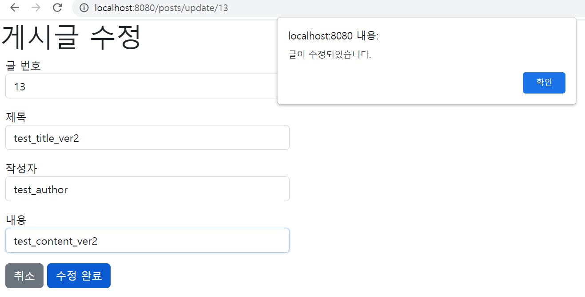  
    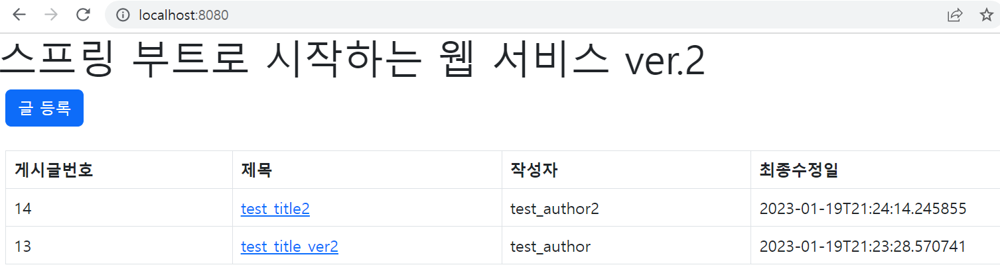  

    - 기존 제목이 '`test_title`'인 게시글이 '`test_title_ver2`'로 정상적으로 수정되었다.  

</br>

### **2) 게시글 삭제 기능 추가하기**  
- `posts-update.mustache` 파일 수정  
    ```html
    <div class="col-md-12 m-2">
        <div class="col-md-4">
            ...
            <a href="/" role="button" class="btn btn-secondary">취소</a>
            <button type="button" class="btn btn-primary" id="btn-update">수정 완료</button>
            <button type="button" class="btn btn-danger" id="btn-delete">삭제</button>
        </div>
    </div>
    ```  
- `index.js` 파일 수정  
    ```javascript
    let main = {
        init : function() {
            let _this = this;
            // ...
            $('#btn-delete').on('click', function() {
                _this.delete();
            })
        },
        save : function () {
            // ...
        },
        update : function() {
            // ...
        },
        delete : function() {
            let id = $('#id').val();

            $.ajax({
                type: 'DELETE',
                url: '/api/v1/posts/' + id,
                dataType: 'json',
                contentType: 'application/json; charset=utf-8'
            }).done(function() {
                alert('글이 삭제되었습니다.');
                window.location.href = '/';
            }).fail(function(error) {
                alert(JSON.stringify(error));
            });
        },
    };

    main.init();
    ```  
- `PostsService` 클래스 수정
    ```java
    @RequiredArgsConstructor
    @Service
    public class PostsService {
        private final PostsRepository postsRepository;

        // ...

        @Transactional
        public void delete(Long id) {
            Posts posts = postsRepository.findById(id)
                    .orElseThrow(() -> new IllegalArgumentException("해당 게시글이 없습니다. id=" + id));
            postsRepository.delete(posts);
        }
    }
    ```  
- `PostsApiController` 클래스 수정  
    ```java
    @Getter
    @RequiredArgsConstructor
    @RestController
    public class PostsApiController {

        private final PostsService postsService;

        // ...

        @DeleteMapping("/api/v1/posts/{id}")
        public Long delete(@PathVariable Long id) {
            postsService.delete(id);
            return id;
        }
    }
    ```  
    - 삭제 버튼 클릭 시 정상적으로 게시글을 삭제할 수 있었다.

    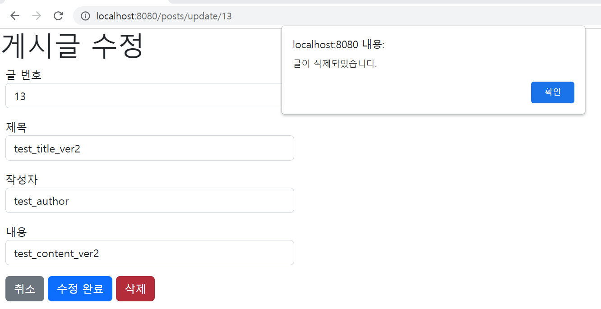  
    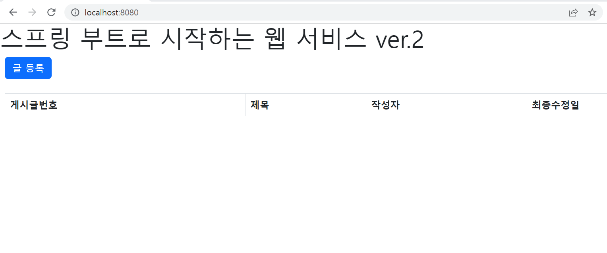  

</br>

## **2. 스프링 시큐리티와 OAuth 2.0으로 로그인 기능 구현하기**  
- **스프링 시큐리티(Spring Security)** 는 막강한 **인증(Authentication)** 과 **인가(Authorization)** 기능을 가진 프레임워크이다.  
- 사실상 스프링 기반의 애플리케이션에서는 보안을 위한 표준이다.  

</br>

### **1) 스프링 시큐리티와 스프링 시큐리티 Oauth2 클라이언트**  
- 많은 서비스에서 로그인 기능을 id/password 방식보다는 구글, 페이스북, 네이버 로그인과 같은 소셜 로그인 기능을 사용한다.  
- 직접 로그인 기능을 구현해야 하는 경우, 보안, 회원정보 찾기 및 변경, 이메일 혹은 전화번호 인증 등을 모두 구현해야 하기 때문이다.  
- OAuth 로그인 구현 시 앞선 기능들을 모두 구글, 페이스북, 네이버 등에 맡기면 되니 서비스 개발에 집중할 수 있게 된다.  

</br>

### **2) 구글 서비스 등록**  
- 먼저 구글 서비스에 신규 서비스를 생성한다.  
- 여기서 발급된 인증 정보(clientId와 clientSecret)를 통해 로그인 기능과 소셜 서비스 기능을 사용할 수 있으니 무조건 발급받고 시작해야 한다.  
- 우선 구글 클라우드 플랫폼(https://console.cloud.google.com)으로 이동하여 새로운 프로젝트를 만든다.  
    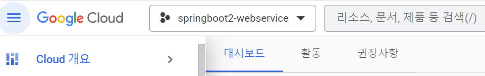  
- 왼쪽 메뉴 탭에서 API 및 서비스 카테고리로 이동한다.  
    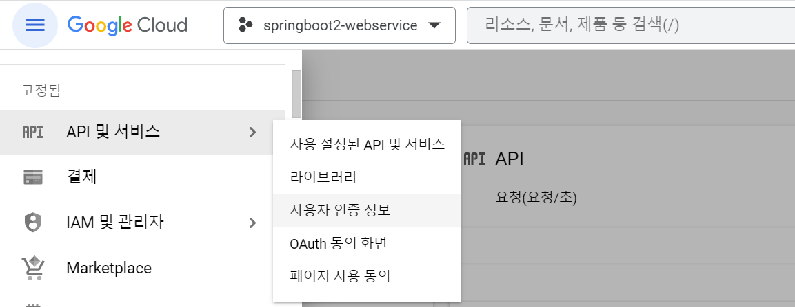  
- '사용자 인증 정보'를 클릭하고 'OAuth 클라이언트 ID' 항목을 클릭한다.
    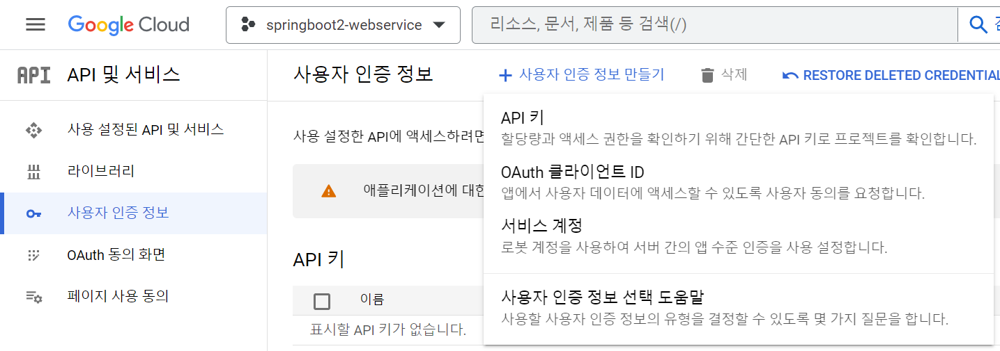  
- 다음과 같이 항목을 작성한다.  
    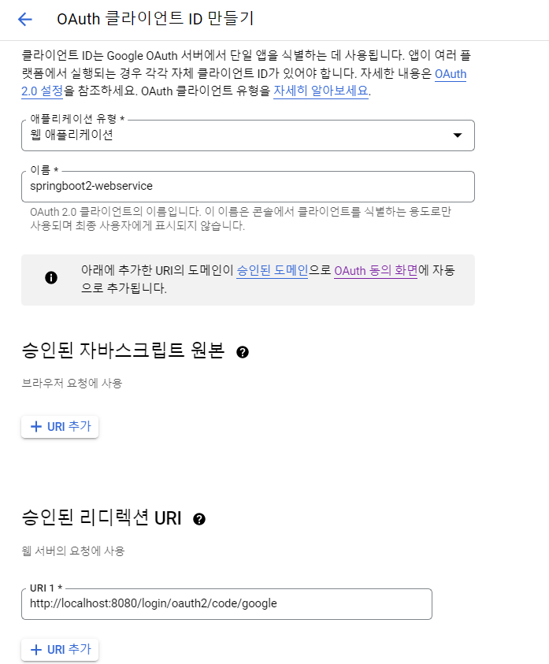  
    - 애플리케이션 이름 : 구글 로그인 시 사용자에게 노출될 애플리케이션 이름을 말한다.  
    - 승인된 리디렉션 URI  
        - 서비스에서 파라미터로 인증 정보를 주었을 때 인증에 성공하면 구글에서 리다이렉트할 URL이다.  
        - 스프링 부트2 버전의 시큐리티에서는 기본적으로 `{도메인}/login/oauth2/code/{소셜서비스코드}`로 리다이렉트 URL을 지원한다.  
        - 사용자가 별도로 리다이렉트 URL을 만들 필요가 없다. (시큐리티에서 이미 구현해 놓은 상태)  
        - 현재는 개발 단계이므로 `http://localhost:8080/login/oauth2/code/google`로만 등록한다.  
        - AWS 서버에 배포하게 되면 `localhost` 외에 추가로 주소를 추가해야 한다.  
- 생성 버튼을 클릭하면 다음 그림과 같이 생성된 클라이언트 정보를 볼 수 있다.  
    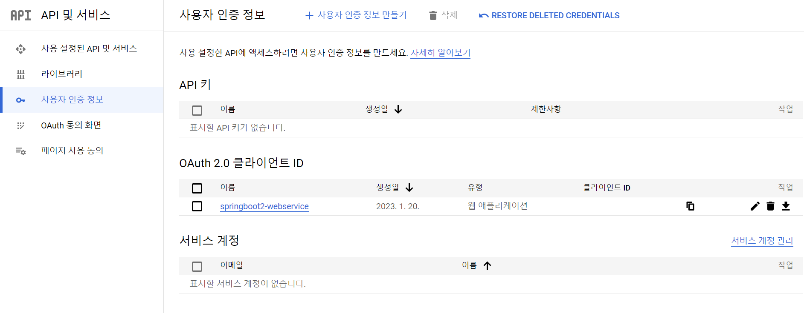  

</br>

- 클라이언트 ID와 클라이언트 보안 비밀 코드를 프로젝트에서 설정한다. (`application-oauth.properties` 파일)
    ```properties
    spring.security.oauth2.client.registration.google.client-id=클라이언트 ID
    spring.security.oauth2.client.registration.google.client-secret=클라이언트 보안 비밀 코드
    spring.security.oauth2.client.registration.google.scope=profile,email
    spring.profiles.include=oauth
    ```  
    - `scope`를 `profile, email`로 설정한 이유는 `openid`를 사용하지 않기 위함이다. (기본값이 `openid, profile, email`이다.)  
    - `openid`라는 `scope`가 있으면 OpenId Provider로 인식하게 된다.  
        - OpenID는 문자 그대로 오픈된 IDentity이다.
        - 즉, 서로 연계된 서비스 간에 사용자의 인증 등을 오픈해 주는 기술을 말한다.  
        - 사용자는 IDP를 통해 특정 애플리케이션에 별도로 회원 가입을 하지 않고 가입과 사용을 할 수 있기 때문에, IDP와 SP(Service Provider) 사이에는 사용자를 인증할 수 있는 증명 정보에 대한 통신이 이뤄져야 한다.  
        - 이러한 IDP와 SP 사이에 신원 정보 증명을 위한 통신이 이뤄지게 하는 기술이 바로 OpenID로 대표되는 OAuth라는 기술이다. 
        - 참고 : https://medium.com/@saltmine_olive/openid%EB%9E%80-%EB%AC%B4%EC%97%87%EC%9D%BC%EA%B9%8C%EC%9A%94-e4565502ef92
    - 이렇게 되면 OpenId Provider인 서비스(구글)와 그렇지 않은 서비스(네이버/카카오 등)로 나눠서 OAuth2Service를 만들어야 한다.  
    - 하나의 OAuth2Service로 사용하기 위해 일부러 `openid` `scope`를 빼고 등록한다.  

</br>

- `application.properties` 파일 수정
    ```properties
    ...  
    spring.profiles.include=oauth
    ```
    - 스프링 부트에서는 `properties`의 이름을 `application-xxx.properties`로 만들면 `xxx`라는 이름의 profile이 생성되어 이를 통해 관리할 수 있다.  
    - 즉, `profile=xxx`라는 식으로 호출하면, 해당 `properties` 의 설정들을 가져올 수 있다.

</br>  

- `.gitignore` 등록  
    ```
    ...
    application-oauth.properties
    ```  
    - ※ `.gitignore` 파일에 추가했음에도 여전히 커밋 목록에 노출된다면 이는 Git의 캐시문제 때문이다.  

</br>

### **3) 구글 로그인 연동**  
- 사용자 정보를 담당할 도메인인 `User` 클래스 생성  
    ```java
    package prac.domain.user;

    import jakarta.persistence.*;
    import lombok.Builder;

    public class User {
        @Id
        @GeneratedValue(strategy = GenerationType.IDENTITY)
        private Long id;

        @Column(nullable = false)
        private String name;

        @Column(nullable = false)
        private String email;

        @Column
        private String picture;

        @Enumerated(EnumType.STRING)
        @Column(nullable = false)
        private Role role;

        @Builder
        public User(String name, String email, String picture, Role role) {
            this.name = name;
            this.email = email;
            this.picture = picture;
            this.role = role;
        }

        public User update(String name, String picture) {
            this.name = name;
            this.picture = picture;

            return this;
        }

        public String getRoleKey() {
            return this.role.getKey();
        }
    }
    ```  
    - `@Enumerated(EnumType.STRING)`  
        - JPA로 데이터베이스에 저장할 때 `Enum` 값을 어떤 형태로 저장할지를 결정한다.  
        - 기본적으로는 `int`로 된 숫자가 저장되는데, 숫자로 저장되면 데이터베이스로 확인할 때 그 값이 무슨 코드를 의미하는지 알 수 가 없으므로 문자열 (`EnumType.STRING`)로 저장되도록 선언한다.  

</br>

- 각 사용자의 권한을 관리할 `Enum` 클래스 `Role`을 생성한다.  
    ```java
    package prac.domain.user;

    import lombok.Getter;
    import lombok.RequiredArgsConstructor;

    @Getter
    @RequiredArgsConstructor
    public enum Role {
        GUEST("ROLE_GUEST", "손님"),
        USER("ROLE_USER", "일반 사용자");

        private final String key;
        private final String title;
    }
    ```  
    - 스프링 시큐리티에서는 권한 코드에 항상 '`ROLE_`'이 앞에 있어야만 한다.  
    - 때문에 코드별 키 값을 `ROLE_GUEST`, `ROLE_USER` 등으로 지정한다.  

</br>

- 마지막으로 `User`의 CRUD를 책임질 `UserRepository`도 생성한다.  
    ```java
    package prac.service;

    import org.springframework.data.jpa.repository.JpaRepository;
    import prac.domain.user.User;

    import java.util.Optional;

    public interface UserRepository extends JpaRepository<User, Long> {
        Optional<User> findByEmail(String email);
    }
    ```  

</br>  

- `build.gradle`에 스프링 시큐리티 관련 의존성을 추가한다.  
    ```gradle
    implementation 'org.springframework.boot:spring-boot-starter-oauth2-client:3.0.1'
    ```  
    - 소셜 로그인 등 클라이언트 입장에서 소셜 기능 구현 시 필요한 의존성이다.

</br>

- `config.auth` 패키지를 생성한 다음(시큐리티 관련 클래스는 모두 이곳에 저장) 그 안에 `SecurityConfig` 클래스를 생성한다.  
    ```java
    package prac.config.auth;

    import lombok.RequiredArgsConstructor;
    import org.springframework.context.annotation.Bean;
    import org.springframework.context.annotation.Configuration;
    import org.springframework.security.config.annotation.web.builders.HttpSecurity;
    import org.springframework.security.config.annotation.web.configuration.EnableWebSecurity;
    import org.springframework.security.web.SecurityFilterChain;
    import prac.domain.user.Role;

    @Configuration
    @RequiredArgsConstructor
    @EnableWebSecurity
    public class SecurityConfig {

        private final CustomOAuth2UserService customOAuth2UserService;

        @Bean
        public SecurityFilterChain filterChain(HttpSecurity http) throws Exception {
            http
                    .authorizeHttpRequests()
                    .requestMatchers("/", "/css/**", "/image/**", "/js/**", "/h2-console/**").permitAll()
                    .requestMatchers("/api/v1/**").hasRole(Role.USER.name())
                    .anyRequest().authenticated()
                    .and()
                        .logout()
                            .logoutSuccessUrl("/")
                    .and()
                        .oauth2Login()
                            .userInfoEndpoint()
                                .userService(customOAuth2UserService);
            return http.build();
        }
    }
    ```  
    - `@Configuration` 
        - 스프링 빈 설정을 담당하는 클래스로 만든다.
        - 이 클래스 안에서 @Bean 어노테이션이 동봉된 메소드를 선언하면, 그 메소드를 통해 스프링 빈을 정의하고 생명주기를 설정한다.  
    - `@EnableWebSecurity`  
        - Spring Security 설정들을 활성화시켜 준다.  
    - `authorizeHttpRequest`  
        - `RequestMatcher`를 사용하여 `HttpServletRequest`를 기반으로 접근을 제한할 수 있다.
        - URL별 권한 관리를 설정하는 옵션의 시작점이다.  
        - `authorizeHttpRequests`가 선언되어야만 `requestMatchers` 옵션을 사용할 수 있다.  
    - `requestMatchers`  
        - 권한 관리 대상을 지정하는 옵션이다.  
        - "`/`" 등 지정된 URL은 `permitAll()` 옵션을 통해 전체 열람 권한을 주었고, "`/api/v1/**`" 주소를 갖는 API는 `USER` 권한을 가진 사람만 가능하도록 했다.  
    - `anyRequest`  
        - 설정된 값들 이외에 나머지 URL들을 나타낸다.  
        - 여기서는 `authenticated()`를 추가하여 나머지 URL들은 모두 인증된(로그인) 사용자들에게만 허용하도록 했다.  
    - `@logout().logoutSuccessUrl("/")`  
        - 로그아웃 기능에 대한 여러 설정의 진입점이다.  
        - 로그아웃 성공 시 "`/`" 주소로 이동한다.  
    - `oauth2Login`
        - OAuth 2 로그인 기능에 대한 여러 설정의 진입점이다.  
    - `userInfoEndpoint`  
        - OAuth 2 로그인 성공 이후 사용자 정보를 가져올 때의 설정들을 담당한다.  
    - `userService`  
        - 소셜 로그인 성공 시 후속 조치를 진행할 UserService 인터페이스의 구현체를 등록한다.  
        - 리소스 서버(소셜 서비스)에서 사용자 정보를 가져온 상태에서 추가로 진행하고자 하는 기능을 명시할 수 있다.  

</br>  

- 교재에 나와 있는 `WebSecurityConfigurerAdapter`를 상속받는 방법이 deprecated 되어서, 대신
`SecurityFilterChain`을 스프링 빈으로 등록하는 방법을 사용했다.  
- 참고 : https://spring.io/blog/2022/02/21/spring-security-without-the-websecurityconfigureradapter  
(스프링 시큐리티에 대한 개념은 깊이 있게 공부해야 할 것 같다...)  

</br>

- `CustomOAuth2UserService` 클래스를 생성한다.  
- 이 클래스에선 구글 로그인 이후 가져온 사용자의 정보(email, name 등)들을 기반으로 가입 및 정보 수정, 세션 저장 등의 기능을 지원한다.  
    ```java
    package prac.config.auth;

    import jakarta.servlet.http.HttpSession;
    import lombok.RequiredArgsConstructor;
    import org.springframework.security.core.authority.SimpleGrantedAuthority;
    import org.springframework.security.oauth2.client.userinfo.DefaultOAuth2UserService;
    import org.springframework.security.oauth2.client.userinfo.OAuth2UserRequest;
    import org.springframework.security.oauth2.client.userinfo.OAuth2UserService;
    import org.springframework.security.oauth2.core.OAuth2AuthenticationException;
    import org.springframework.security.oauth2.core.user.DefaultOAuth2User;
    import org.springframework.security.oauth2.core.user.OAuth2User;
    import org.springframework.stereotype.Service;
    import prac.config.auth.dto.OAuthAttributes;
    import prac.config.auth.dto.SessionUser;
    import prac.domain.user.User;
    import prac.service.UserRepository;

    import java.util.Collections;


    @RequiredArgsConstructor
    @Service
    public class CustomOAuth2UserService implements OAuth2UserService<OAuth2UserRequest, OAuth2User> {
        private final UserRepository userRepository;
        private final HttpSession httpSession;

        @Override
        public OAuth2User loadUser(OAuth2UserRequest userRequest) throws OAuth2AuthenticationException {
            OAuth2UserService<OAuth2UserRequest, OAuth2User> delegate = new DefaultOAuth2UserService();
            OAuth2User oAuth2User = delegate.loadUser(userRequest);

            String registrationId = userRequest.getClientRegistration().getRegistrationId();
            String userNameAttributeName = userRequest.getClientRegistration().getProviderDetails().getUserInfoEndpoint().getUserNameAttributeName();

            OAuthAttributes attributes = OAuthAttributes.of(registrationId, userNameAttributeName, oAuth2User.getAttributes());

            User user = saveOrUpdate(attributes);

            httpSession.setAttribute("user", new SessionUser(user));

            return new DefaultOAuth2User(
                    Collections.singleton(new SimpleGrantedAuthority(user.getRoleKey())),
                    attributes.getAttributes(),
                    attributes.getNameAttributeKey());
        }

        private User saveOrUpdate(OAuthAttributes attributes) {
            User user = userRepository.findByEmail(attributes.getEmail())
                    .map(entity -> entity.update(attributes.getName(), attributes.getPicture()))
                    .orElse((attributes.toEntity()));

            return userRepository.save(user);
        }
    }
    ```  
    - `registrationId`  
        - 현재 로그인 진행 중인 서비스를 구분하는 코드이다.  
        - 이후 네이버 로그인 연동 시에 네이버 로그인인지, 구글 로그인인지 구분하기 위해 사용한다.  
    - `userNameAttributeName`  
        - OAuth2 로그인 진행 시 키(Primary key)가 되는 필드값을 말한다.  
        - 구글의 경우 기본적으로 코드를 지원하지만, 네이버, 카카오 등은 지원하지 않는다.  
        (구글의 기본 코드 : "`sub`")  
        - 이후 네이버 로그인과 구글 로그인을 동시 지원할 때 사용한다.  
    - `OAuthAttributes`  
        - `OAuth2UserService`를 통해 가져온 `OAuth2User`의 `attribute`을 담을 클래스이다.  
        - 이후 네이버 등 다른 소셜 로그인도 이 클래스를 사용한다.  
    - `SessionUser`  
        - 세션에 사용자 정보를 저장하기 위한 Dto 클래스이다.  
    
</br>

- `config.auth.dto` 패키지를 만든 후, 그 안에 `OAuthAttributes` 클래스를 생성한다.  
    ```java
    package prac.config.auth.dto;

    import lombok.Builder;
    import lombok.Getter;
    import prac.domain.user.Role;
    import prac.domain.user.User;

    import java.util.Map;

    @Getter
    public class OAuthAttributes {
        private Map<String, Object> attributes;
        private String nameAttributeKey;
        private String name;
        private String email;
        private String picture;

        @Builder
        public OAuthAttributes(Map<String, Object> attributes, String nameAttributeKey, String name, String email, String picture) {
            this.attributes = attributes;
            this.nameAttributeKey = nameAttributeKey;
            this.name = name;
            this.email = email;
            this.picture = picture;
        }

        public static OAuthAttributes of(String registrationId, String userNameAttributeName, Map<String, Object> attributes) {
            return ofGoogle(userNameAttributeName, attributes);
        }

        private static OAuthAttributes ofGoogle(String userNameAttributeName, Map<String, Object> attributes) {
            return OAuthAttributes.builder()
                    .name((String) attributes.get("name"))
                    .email((String) attributes.get("email"))
                    .picture((String) attributes.get("picture"))
                    .attributes(attributes)
                    .nameAttributeKey(userNameAttributeName)
                    .build();
        }

        public User toEntity() {
            return User.builder()
                    .name(name)
                    .email(email)
                    .picture(picture)
                    .role(Role.GUEST)
                    .build();
        }
    }
    ```  
    - `of()`
        - `OAuth2User`에서 반환하는 사용자 정보는 `Map`이기 때문에 값 하나하나를 변환해 주어야 한다.  
    - `toEntity()`
        - `User` 엔티티를 생성한다.  
        - `OAuthAttributes`에서 엔티티를 생성하는 시점은 처음 가입할 때이다.  
        - 가입할 때의 기본 권한을 `GUEST`로 주기 위해서 `role` 빌더값에는 `Role.GUEST`를 사용한다.  

</br>  

- `OAuthAttributes` 클래스 생성이 끝났으면, `SessionUser` 클래스를 생성한다.  
    ```java
    package prac.config.auth.dto;

    import lombok.Getter;
    import prac.domain.user.User;

    import java.io.Serializable;

    @Getter
    public class SessionUser implements Serializable {
        private String name;
        private String email;
        private String picture;

        public SessionUser(User user) {
            this.name = user.getName();
            this.email = user.getEmail();
            this.picture = user.getPicture();
        }
    }
    ```  
    - `SessionUser`에는 인증된 사용자 정보만을 필요로 한다.  

</br>

- `User` 클래스를 사용하지 않는 이유
    - 세션에 저장하기 위해서는 직렬화를 구현해야 한다.  
    - `User` 클래스에 직렬화 코드를 넣는 것은 바람직하지 않은데, 이는 `User` 클래스가 엔티티(Entity)이기 때문이다.  
    - 엔티티 클래스는 언제 다른 엔티티와 관계(Relation)이 형성될지 모른다.  
    - 예를 들어 `@OneToMany`, `@ManyToMany` 등 자식 엔티티를 갖고 있다면 직렬화 대상에 자식들까지 포함되니 성능 이슈, 부수 효과가 발생할 확률이 높다.  
    - 그래서 직렬화 기능을 갖는 세션 Dto를 하나 추가로 만드는 것이 이후 운영 및 유지보수 때 많은 도움이 된다.  

</br>

- `index.mustache` 파일에 로그인 버튼과 로그인 성공 시 사용자의 이름을 보여주는 코드를 추가한다.  
    ```html
    {{>layout/header}}

    <h1>스프링 부트로 시작하는 웹 서비스 ver.2</h1>
    <div class="col-md-12 m-2">
        <!-- 로그인 기능 영역 -->
        <div class="row">
            <div class="col-md-6">
                <a href="/posts/save" role="button" class="btn btn-primary">글 등록</a>
                {{#userName}}
                    Logged in as : <span id="user">{{userName}}</span>
                    <a href="/logout" class="btn btn-info active" role="button">Logout</a>
                {{/userName}}
                {{^UserName}}
                    <a href="/oauth2/authorization/google" class="btn btn-success active" role="button">Google Login</a>
                {{/UserName}}
            </div>
        </div>
        <br />
        <!-- 목록 출력 영역 -->
        ...
    </div>

    {{>layout/footer}}
    ```  
    - ``{{#userName}}``  
        - userName이 있다면 userName을 노출시킨다. ('if'와 역할)  
    - `a href="/logout"`  
        - 스프링 시큐리티에서 기본적으로 제공하는 로그아웃 URL이다.  
        - 별도로 저 URL에 해당하는 컨트롤러를 만들 필요가 없다.  
        - `SecurityConfig` 클래스에서 해당 URL을 변경할 수 있다.  
    - `{{^userName}}`  
        - userName이 없다면 로그인 버튼을 노출 시킨다. ('if not'과 같은 역할)  

</br>

- `IndexController`에서 `userName`을 `model`에 저장하는 코드를 추가한다.  
    ```java
    package prac.web;

    import jakarta.servlet.http.HttpSession;
    import lombok.RequiredArgsConstructor;
    import org.springframework.stereotype.Controller;
    import org.springframework.ui.Model;
    import org.springframework.web.bind.annotation.GetMapping;
    import org.springframework.web.bind.annotation.PathVariable;
    import prac.config.auth.dto.SessionUser;
    import prac.service.PostsService;
    import prac.web.dto.PostsResponseDto;

    @RequiredArgsConstructor
    @Controller
    public class IndexController {

        private final PostsService postsService;
        private final HttpSession httpSession;

        @GetMapping("/")
        public String index(Model model) {
            model.addAttribute("posts", postsService.findAllDesc());

            SessionUser user = (SessionUser) httpSession.getAttribute("user");

            if (user != null) {
                model.addAttribute("userName", user.getName());
            }
            
            return "index";
        }
    }
    ```  
    - `(SessionUser) httpSession.getAttribute("user")`
        - 로그인 성공 시 '`httpSession.getAttribute("user")`'에서 값을 가져올 수 있다.  
    - `if (user != null)`  
        - 세션에 저장된 값이 있을 때만 `model`에 `userName`으로 등록한다.  
        - 세션에 저장된 값이 없으면 `model`에 아무런 값이 없는 상태이니 로그인 버튼만 보이게 된다.  

</br>

- 로그인 테스트  
    - 로그인 후 게시글을 작성하려고 하면 403(권한 거부) 에러가 발생한다.  
    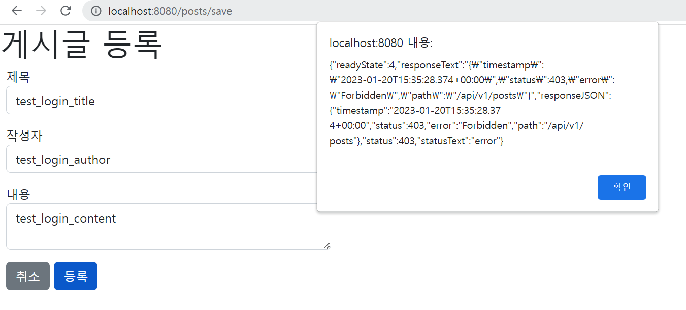    
    - 이는, 현재 로그인된 사용자의 권한이 `GUEST`이기 때문에, `posts` 기능을 사용하지 못하여 발생하는 에러이다.
    - 로그인된 사용자의 권한을 `GUEST`에서 `USER`로 변경하면 다음과 같이 정상적으로 게시글이 등록된다.  
        
    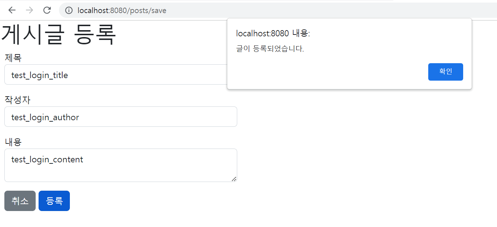   
    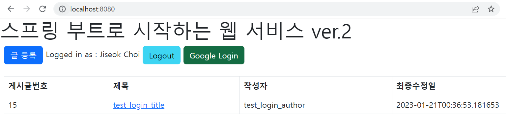    
    - 나머지 로그인에 관한 기능도 정상적으로 잘 동작한다.  
