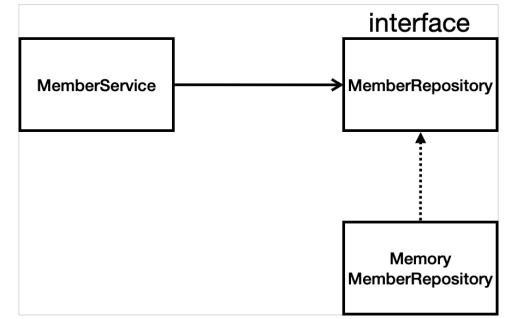

✍️ **TIL (2023-01-12)**
===  

</br>

## **1. 시작하기**

- **Spring Initializr** : 스프링 부트 기반 스프링 프로젝트를 만들어 주는 사이트  
    
- Gradle : 오픈 소스 빌드 도구 (버전 설정, 라이브러리 추가 등 기능 제공)  
(Gradle is an open-source build automation tool focused on flexibility and performance.)  

<br>

- `build.gradle` 설정
    ```gradle
    plugins {
        java
        id("org.springframework.boot") version "3.0.1"
        id("io.spring.dependency-management") version "1.1.0"
    }

    group = "hello"
    version = "0.0.1-SNAPSHOT"
    java.sourceCompatibility = JavaVersion.VERSION_17

    repositories {
        // 아래의 라이브러리들을 mavenCentral이라는 Android Studio Gradle 플러그인 용 저장소에서 받아온다.
        mavenCentral()  
    }

    dependencies {
        implementation("org.springframework.boot:spring-boot-starter-thymeleaf")  // 템플릿 엔진
        implementation("org.springframework.boot:spring-boot-starter-web")
        testImplementation("org.springframework.boot:spring-boot-starter-test")
    }

    tasks.withType<Test> {
        useJUnitPlatform()
    }
    ```  

</br>


## **2. 라이브러리 살펴보기**
- Gradle은 Dependency가 있는 라이브러리를 함께 다운로드 한다.  
(해당 라이브러리가 필요로 하는 다른 라이브러리들도 같이 다운로드 한다.)
    
- 요즘에는 소스 라이브러리에서 웹 서버(e.g. Tomcat)를 내장하고 있다. → 따로 설정할 필요 없이 웹 서버가 뜬다.
- 스프링부트와 관련된 라이브러리들을 사용할 경우, 스프링 코어까지 스프링과 관련된 것들이 세팅된다. 

</br>

- 스프링 부트 라이브러리
    - spring-boot-starter-web
        - spring-boot-starter-tomcat: 톰캣 (웹서버)
        - spring-webmvc: 스프링 웹 MVC
    - spring-boot-starter-thymeleaf: 타임리프 템플릿 엔진(View)
    - spring-boot-starter(공통): 스프링 부트 + 스프링 코어 + 로깅
        - spring-boot
            - spring-core
        - spring-boot-starter-logging
            - logback, slf4j  

</br>

- 테스트 라이브러리
    - spring-boot-starter-test
        - junit: 테스트 프레임워크
        - mockito: 목 라이브러리
        - assertj: 테스트 코드를 좀 더 편하게 작성하게 도와주는 라이브러리
        - spring-test: 스프링 통합 테스트 지원

</br>

## **3. View 환경설정**

### 1) Welcome page 만들기
- `static/index.html`을 올려두면 Welcome page 기능을 제공한다. 
(참고 : [Spring boot docs](https://docs.spring.io/spring-boot/docs/2.3.1.RELEASE/reference/html/spring-boot-features.html#boot-features-spring-mvc-welcome-page))  

</br>

### 2) **Thymeleaf 템플릿 엔진**
- **템플릿 엔진** : 지정된 템플릿 양식과 데이터를 합쳐서 HTML 문서를 출력하는 소프트웨어
    - 서버 사이드 템플릿 엔진
        - 서버에서 DB 또는 API에서 가져온 데이터를 템플릿에 넣어 HTML 문서로 만들어 클라이언트에 전달한다.
        - Thymeleaf, JSP, Freemaker 등
    - 클라이언트 사이드 템플릿 엔진
        - HTML 형태로 코드를 작성할 수 있으며 동적으로 DOM을 그리게 해주는 역할을 한다.
        - 즉, 데이터를 받아 DOM 객체에 동적으로 그려주는 프로세스를 담당한다.   
        - React, Vue 등

</br>

- [Thymeleaf](https://www.thymeleaf.org/)
    - 서버 사이드 템플릿의 일종으로 스프링 프레임워크와 완전한 통합 기능을 제공한다.
    - MVC 기반 웹 애플리케이션의 View 레이어에서 XHTML/HTML5를 서비스하는데 적합하다.

</br>

- thymeleaf 템플릿 엔진 동작 확인  
    
    - `~/hello`를 받으면 톰켓 내장 서버에서 스프링에 이를 던져준다.
    - 스프링을 통해 `helloController`의 `getMapping("hello")`과 매핑되고, 아래의 메소드가 실행된다.  
    (인자로 받는 `model`은 스프링이 만들어서 넣어준다.)
    - `return "hello"`를 통해 `/resources/templates/hello.html`를 찾아 렌더링한다.  
    ```html
    <!--templates/hello.html-->

    <!DOCTYPE HTML>
    <!--템플릿 엔진 안에서 thymeleaf 문법을 사용하게 해준다.-->
    <html xmlns:th="http://www.thymeleaf.org">
    <head>
        <title>Hello</title>
        <meta http-equiv="Content-Type" content="text/html; charset=UTF-8" />
    </head>
    <body>
    <p th:text="'안녕하세요. ' + ${data}" >안녕하세요. 손님</p>
    </body>
    </html>
    ```
    ```java
    // controller/HelloController

    package hello.hellospring.controller;

    import org.springframework.stereotype.Controller;
    import org.springframework.ui.Model;
    import org.springframework.web.bind.annotation.GetMapping;

    @Controller
    public class HelloController {
        @GetMapping("hello")
        public String hello(Model model) {
            model.addAttribute("data", "hello!!");  // data를 "hello!!"로 치환
            return "hello";
        }
    }
    ```
      

</br>

- 컨트롤러에서 리턴 값으로 문자를 반환하면 `viewResolver`가 화면을 찾아서 처리한다.
    - 스프링부트 템플릿엔진 기본 viewName 매핑
    - `'resources:templates/' + {ViewName} + '.html'`  

</br>

- > 참고: `spring-boot-devtools` 라이브러리를 추가하면, html 파일을 컴파일만 해주면 서버 재시작 없이
View 파일 변경이 가능하다.

</br>

## **4. 빌드**
- `gradlew.bat` 파일을 실행했더니 `jar` 파일이 있어야 할 `/libs` 폴더가 만들어지지 않았다.  
- `$gradlew clean`으로 빌드한 걸 지워주고, 다시 `$gradlew build`로 다시 빌드하니 `/libs` 폴더가 정상적으로 만들어졌다.
- 아래 화면은 만들어진 `jar` 파일을 정상적으로 실행시킨 모습이다.
    

- 서버에 배포할 땐 이 `jar` 파일만 복사해서 서버에 넣고,
개인 이 파일을 실행시키기만 하면 된다.  

</br>

## **5. 정적 컨텐츠**
- [**정적 컨텐츠**](https://docs.spring.io/spring-boot/docs/2.3.1.RELEASE/reference/html/spring-boot-features.html#boot-features-spring-mvc-static-content)
    - 누가 언제 서버에 요청하더라도 동일한 내용이 보여지는 콘텐츠
    - 서버에서 html 파일을 그대로 웹 브라우저에 내려주는 것
- 동적 컨텐츠
    - 누가, 언제, 어떻게 서버에 요청했는지에 따라 각각 다른 내용이 보여지는 콘텐츠 (사용자 맞춤형 콘텐츠 제공)
    - 서버에서 프로그래밍을 통해 html 파일을 동적으로 바꾸어 내려주는 것  

</br>

- `resources/static` 디렉토리 내에 `hello-static.html` 파일을 만들어주면, URL 창에 `http://localhost:8080/hello-static.html`에 해당 정적 페이지가 보여진다.
      

</br>

## **6. MVC와 템플릿 엔진**
- **MVC 패턴**
    - 애플리케이션을 구성할 때 **Model, View, Controller** 의 3가지로 구성하는 개발 방법론.
    - 사용자 인터페이스로부터 비즈니스 로직을 분리하여, 애플리케이션의 시각적 요소나 그 이면에서 실행되는 비즈니스 로직을 서로 영향 없이 쉽게 고칠 수 있는 애플리케이션을 만들 수 있다.
- (1) **Model**
    - 데이터베이스에서 데이터를 가지고 올 수 있고 데이터를 가지고 있을 수도 있다.
    - 컨트롤러에게 데이터를 전달한다.
    - 모델이 뷰와 직접 소통하지는 않는다. 
    - 뷰나 컨트롤러에 대해서 어떠한 정보도 알지 말아야 한다.
    - 변경이 일어나면, 변경 통지에 대한 처리방법을 구현해야 한다.
- (2) **View**
    - 유저가 보는 화면을 보여주게 하는 역할이다.
    - 데이터를 받고 그리는 역할을 수행한다.
    - 모델이나 데이터베이스와는 소통하지 않고 컨트롤러와만 소통한다.
    - 컨트롤러에게 엑션이나 데이터를 전달만 하고 전달 받기만 한다.
- (3) **Controller**
    - 뷰에서 엑션과 이벤트에 대한 인풋 값을 받는다.
    - 모델에게 전달해주기 전에 데이터를 가공할 수 있다.
    - 뷰에게 모델에게 받은 데이터를 가공하여 넘겨준다.
- 웹에 적용 시
    - 사용자(User)가 웹사이트에 접속한다.
    - Controller는 사용자가 요청한 웹페이지를 서비스하기 위해서 모델을 호출한다.
    - Model은 데이터베이스나 파일과 같은 데이터 소스를 제어한 후 그 결과를 리턴한다.
    - Controller는 Model이 리턴한 결과를 View에 반영한다.
    - 데이터가 반영된 View가 사용자에게 보여진다.  

</br>

- Controller
    ```java
    // controller/HelloController

    public class HelloController {
        @GetMapping("hello-mvc")

        public String helloMvc(@RequestParam(name = "name", required = false) String name, Model model) {  
            model.addAttribute("name", name);
            return "hello-template";
        }
    }
    ```
- View
    ```html
    <!--resources/templates/hello-template.html-->

    <html xmlns:th="http://www.thymeleaf.org">
    <body> <!--모델에서 key 값이 'name'인 것을 찾아 치환한다.-->
        <p th:text="'hello ' + ${name}">hello! empty</p>
    </body>
    ```  
      
    
</br>

- MVC와 템플릿 이미지  
      

</br>

## **7. API**
- View를 템플릿 엔진을 통해 렌더링하여 HTML 파일을 보내주는 방식과 달리,  
API를 통해 데이터를 직접적으로 내려주는 방식도 존재한다.
    ```java
    // @ResponseBody 객체 반환

    @Controller
    public class HelloController {  

        @GetMapping("hello-api")
        @ResponseBody
        public Hello helloApi(@RequestParam("name") String name) {
            Hello hello = new Hello();
            hello.setName(name);
            return hello;
        }

        static class Hello {
            private String name;

            public String getName() {
                return name;
            }

            public void setName(String name) {
                this.name = name;
            }
        }
    }
    ```  
- 위와 같이 객체를 반환하면 JSON 형식으로 출력된다.
      

</br>

- `@ResponseBody` 사용 원리  
      
    - `'localhost:8080/hello-api'`가 들어오면 tomcat 내장 서버에서 'hello-api'가 왔다고 스프링에 넘겨준다.
    - 'hello-api'에 `@ResponseBody` Annotation이 붙어 있는 걸 확인한다.
    - HttpMessageConverter(중 JsonConverter)가 동작하여 객체를 JSON으로 바꾸어 보내준다.
        - 기본 문자처리 : StringHttpMessageConverter
        - 기본 객체처리 : MappingJackson2HttpMessageConverter
        - byte 처리 등등 기타 여러 HttpMessageConverter가 기본으로 등록되어 있다.  

    </br>

    - > 참고: 클라이언트의 HTTP Accept 해더와 서버의 컨트롤러 반환 타입 정보 둘을 조합해서
    HttpMessageConverter가 선택된다.  

</br>

## **8. 비즈니스 요구사항 정리 (회원관리 예제 - 백엔드 개발)**

- 비즈니스 요구사항
    - 데이터 : 회원ID, 이름
    - 기능 : 회원 등록, 조회
    - 아직 데이터 저장소가 선정되지 않음 (가상의 시나리오)

</br>

- 일반적인 웹 애플리케이션 계층 구조  
      
    - 컨트롤러: 웹 MVC의 컨트롤러 역할을 한다.
    - 서비스: 핵심 비즈니스 로직을 구현한다.
    - 리포지토리: 데이터베이스에 접근, 도메인 객체를 DB에 저장하고 관리한다.
    - 도메인: 비즈니스 도메인 객체, 예) 회원, 주문, 쿠폰 등등 주로 데이터베이스에 저장하고 관리된다.  

</br>

- 클래스 의존 관계  
    
    - 아직 데이터 저장소가 선정되지 않아서, 우선 인터페이스로 구현 클래스를 변경할 수 있도록 설계한다.
    - 데이터 저장소는 RDB, NoSQL 등등 다양한 저장소를 고민중인 상황으로 가정한다.
    - 개발을 진행하기 위해서 초기 개발 단계에서는 구현체로 가벼운 메모리 기반의 데이터 저장소를 사용한다.

</br>

## **9. 회원 도메인과 레포지토리 만들기**
- 회원 객체
    ```java
    // domain/Member.java

    package hello.hellospring.domain;

    public class Member {
        private Long id;
        private String name;

        public Long getId() {
            return id;
        }

        public void setId(Long id) {
            this.id = id;
        }

        public String getName() {
            return name;
        }

        public void setName(String name) {
            this.name = name;
        }
    }
    ```  
- 회원 레포지토리 인터페이스
    ```java
    // repository/MemberRepository.java

    package hello.hellospring.repository;

    import hello.hellospring.domain.Member;
    import java.util.*;

    public interface MemberRepository {
        Member save(Member member);
        // null 값이 반환될 수 있는 경우 'Optional'로 한 번 감싸준다.
        Optional<Member> findById(Long id);
        Optional<Member> findByName(String name);
        List<Member> findAll();
    }
    ```  
- 회원 레포지토리 메모리 구현체
    ```java
    // repository/MemoryMemberRepository.java

    package hello.hellospring.repository;

    import hello.hellospring.domain.Member;

    import java.util.*;

    public class MemoryMemberRepository implements MemberRepository {

        // 동시성 문제가 고려되어 있지 않다. 실무에서는 ConcurrentHashMap, AtomicLong 등의 사용을 고려한다.
        private static Map<Long, Member> store = new HashMap<>();
        private static long sequence = 0L;

        @Override
        public Member save(Member member) {
            member.setId(++sequence);  // name은 클라이언트에서 받아오고, Id는 여기서 만든다.
            store.put(member.getId(), member);
            return member;
        }

        @Override
        public Optional<Member> findById(Long id) {
            return Optional.ofNullable(store.get(id));
        }

        @Override
        public Optional<Member> findByName(String name) {
            return store.values().stream()
                    .filter(member -> member.getName().equals(name))
                    .findAny();
        }

        @Override
        public List<Member> findAll() {
            return new ArrayList<>(store.values());
        }

        public void clearStore() {
            store.clear();
        }
    }
    ```  

</br>

## **10. 회원 레포지토리 테스트 케이스 작성**
- 개발한 기능을 실행해서 테스트 할 때, main 메서드를 통해서 실행하거나, 웹 애플리케이션의 컨트롤러를 통해서 해당 기능을 실행한다. 
- 이러한 방법은 준비하고 실행하는데 오래 걸리고, 반복 실행하기
어려우며, 여러 테스트를 한번에 실행하기 어렵다는 단점이 있다.  
- 이러한 문제는 자바의 'JUnit'이라는 프레임워크로 테스트를 실행함으로써 해결할 수 있다.
    ```java
    // src/test/java 하위 폴더

    package hello.hellospring.repository;

    import hello.hellospring.domain.Member;
    import static org.assertj.core.api.Assertions.*;
    import org.junit.jupiter.api.AfterEach;  // 각각의 @Test가 끝난 다음 호출된다.
    import org.junit.jupiter.api.Test;

    import java.util.List;


    class MemoryMemberRepositoryTest {
        MemoryMemberRepository repository = new MemoryMemberRepository();

        // 테스트는 서로 의존 관계가 있으면 안 된다.
        // → 하나의 테스트가 끝날 때마다 저장소나 공용데이터들을 깔끔하게 지워줘야 문제가 안 생긴다.
        @AfterEach
        public void afterEach() {
            repository.clearStore();
        }

        @Test
        public void save() {
            Member member = new Member();
            member.setName("spring");
            repository.save(member);
            Member result = repository.findById(member.getId()).get();
            assertThat(member).isEqualTo(result);
        }

        @Test
        public void findByName() {
            Member member1 = new Member();
            member1.setName("spring1");
            repository.save(member1);

            Member member2 = new Member();
            member2.setName("spring2");
            repository.save(member2);

            Member result = repository.findByName("spring2").get();
            assertThat(result).isEqualTo(member2);
        }

        @Test
        public void findAll() {
            Member member1 = new Member();
            member1.setName("spring1");
            repository.save(member1);

            Member member2 = new Member();
            member2.setName("spring2");
            repository.save(member2);

            List<Member> result = repository.findAll();

            assertThat(result.size()).isEqualTo(2);
        }
    }
    ```  
- 한번에 여러 테스트를 실행하면 메모리 DB에 직전 테스트의 결과가 남아, 이전 테스트 때문에 다음 테스트가 실패할 가능성이 있다.  
- 이러한 문제를 예방하기 위해 `@AfterEach`를 사용하여 각 Test마다 메모리 DB에 저장된 데이터를 지워준다.
- 위와 같은 테스트는 각각 독립적으로 실행되어야 하며, 테스트 순서에 의한 의존관계가 생기면 안 된다.

</br>

## **11. 회원 서비스 개발**
- 회원 서비스 개발
    ```java
    package hello.hellospring.service;

    import hello.hellospring.domain.Member;
    import hello.hellospring.repository.MemberRepository;

    import java.util.List;
    import java.util.Optional;

    public class MemberService {

        private final MemberRepository memberRepository;

        // 'memberRepository'를 직접 생성하지 않고 외부에서 넣어준다. → Dependency Injection (DI)
        public MemberService(MemberRepository memberRepository) {
            this.memberRepository = memberRepository;
        }

        /**
        * 회원 가입
        */
        public Long join(Member member) {
            validateDuplicateMember(member);  // 중복 회원 검증
            memberRepository.save(member);
            return member.getId();
        }

        /**
        * 중복 회원 가입 여부 확인
        */
        private void validateDuplicateMember(Member member) {
            memberRepository.findByName(member.getName())
                .ifPresent(m -> {
                    throw new IllegalStateException("이미 존재하는 회원입니다.");
                });
        }

        /**
        * 전체 회원 조회
        */
        public List<Member> findMembers() {
            return memberRepository.findAll();
        }

        /**
        * 특정 회원 조회
        */
        public Optional<Member> findOne(Long memberId) {
            return memberRepository.findById(memberId);
        }
    }
    ```  

</br>

## **12. 회원 서비스 테스트**
- 회원 서비스 테스트
    ```java
    package hello.hellospring.service;

    import hello.hellospring.domain.Member;

    import static org.assertj.core.api.Assertions.*;
    import static org.junit.jupiter.api.Assertions.*;

    import hello.hellospring.repository.MemoryMemberRepository;
    import org.junit.jupiter.api.AfterEach;
    import org.junit.jupiter.api.BeforeEach;
    import org.junit.jupiter.api.Test;

    class MemberServiceTest {

        MemberService memberService;
        MemoryMemberRepository memberRepository = new MemoryMemberRepository();

        // @BeforeEach : 각 테스트 실행 전 매번 호출된다.
        // 테스트가 서로 영향이 없도록 항상 새로운 객체를 생성하고, 의존관계도 새로 맺어준다
        @BeforeEach
        public void beforeEach() {
            memberRepository = new MemoryMemberRepository();
            memberService = new MemberService(memberRepository);
        }

        @AfterEach
        public void afterEach() {
            memberRepository.clearStore();
        }

        @Test
        void join() {
            // given
            Member member = new Member();
            member.setName("hello");

            // when
            Long saveId = memberService.join(member);

            // then
            Member findMember = memberService.findOne(saveId).get();
            assertThat(member.getName()).isEqualTo(findMember.getName());
        }

        @Test
        void duplicateMemberException() {
            // given
            Member member1 = new Member();
            member1.setName("spring");

            Member member2 = new Member();
            member2.setName("spring");

            // when
            memberService.join(member1);

            // then
            /*
            try {
                memberService.join(member2);
                fail("예외가 발생해야 합니다.");
            } catch (IllegalStateException e) {
                assertThat(e.getMessage()).isEqualTo("이미 존재하는 회원입니다.");
            }
            */
            IllegalStateException e = assertThrows(IllegalStateException.class, () -> memberService.join(member2));
            assertThat(e.getMessage()).isEqualTo("이미 존재하는 회원입니다.");
        }

        @Test
        void findMembers() {
        }

        @Test
        void findOne() {
        }
    }
    ```  
