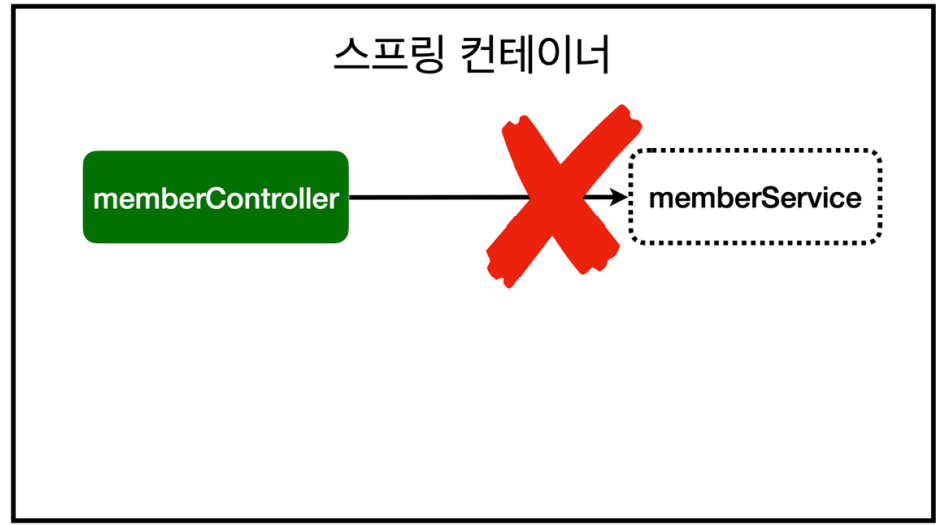
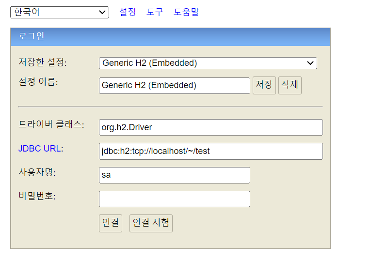
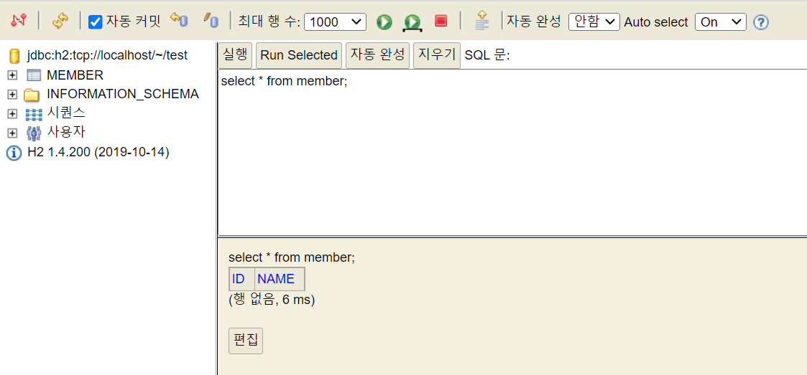
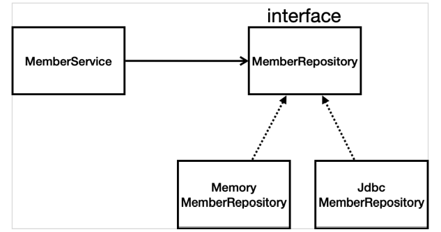
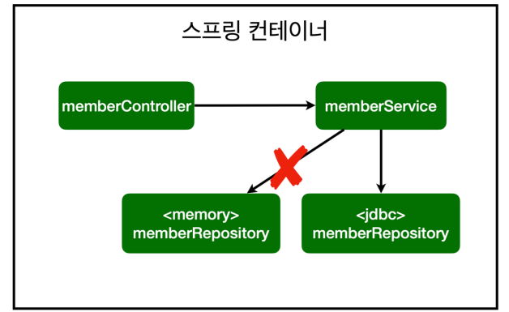

✍️ **TIL (2023-01-13)**
===  

</br>

## **1. 스프링 빈과 의존 관계**
- 스프링 빈을 등록하고 의존 관계 설정하기
    ```java
    package hello.hellospring.controller;

    import hello.hellospring.service.MemberService;
    import org.springframework.beans.factory.annotation.Autowired;
    import org.springframework.stereotype.Controller;


    // 스프링 컨테이너와 스프링 빈이 생성될 때 아래와 같은 @Controller 어노테이션이 붙어있는
    // 멤버 컨트롤러 객체들은 생성되어 스프링이 관리를 받는다.
    // 이를 스프링 컨테이너에서 스프링 빈을 관리한다고 한다.
    @Controller
    public class MemberController {
        private final MemberService memberService;

        @Autowired  // memberService를 스프링 컨테이너에 있는 MemberService를 가져와 연결시켜 준다. (DI)
        public MemberController(MemberService memberService) {
            // memberService를 찾을 수 없다는 애러 → MemberService는 스프링 컨테이너가 관리하는 객체가 아닌 일반 클래스이기 때문
            // → MemberService 클래스 위에 '@Service'라는 어노테이션을 붙여준다.
            this.memberService = memberService;
        }
    }
    ```  
    - 생성자에 `@Autowired` 가 있으면 스프링이 연관된 객체를 스프링 컨테이너에서 찾아서 넣어준다. 
    - 이처럼 객체 의존관계를 외부에서 넣어주는 것을 DI (Dependency Injection), 의존성 주입이라 한다.
    - 이전 테스트에서는 개발자가 직접 주입했고, 여기서는 `@Autowired`에 의해 스프링이 주입해준다.

</br>  

- 이때, 에러가 발생하는 이유는 아직 스프링 컨테이너에 의해 `MemberService`가 등록되지 않았기 때문이다.
    ```
    Consider defining a bean of type 'hello.hellospring.service.MemberService' in your configuration.
    ```
- 다음과 같이 서비스는 `@Service` 어노테이션을, 레포지토리는 `@Repository` 어노테이션을 붙여줌으로써 스프링 컨테이너에 의해 관리되는 스프링 빈으로 만들어 줄 수 있다.
      
    ```java
    @Service
    public class MemberService {

        private final MemberRepository memberRepository;

        @Autowired  // 컨테이너에 객체가 등록되기 위해 생성자가 호출될 때 스프링 컨테이너에 있는 MemberRepository를 가져와서 넣어준다.
        public MemberService(MemberRepository memberRepository) {
            this.memberRepository = memberRepository;
        }
    }
    ```  

</br>

- 스프링 빈을 등록하는 방법 2가지
    - (1) 컴포넌트 스캔과 자동 의존관계 설정
        - `@Component` 어노테이션이 붙어 있으면 스프링이 객체를 하나씩 생성하여 스프링 컨테이너에 스프링 빈으로 등록한다.  
            - `@Controller`, `@Repository`, `@Service` 등은 `@Component`를 포함한다.
            - `HelloSpringApplication`이 포함되어 있는 `hello/hellospring`을 포함한 하위 패키지에서만 자동적으로 컴포넌트 스캔이 이루어지며, 나머지는 따로 설정을 해줘야 한다.
        - 스프링은 스프링 컨테이너에 스프링 빈을 등록할 때, 기본으로 싱글톤으로 등록한다.  
            - 즉, 유일하게 하나만 등록해서 공유하므로, 같은 스프링 빈이면 모두 같은 인스턴스다. 
            - 설정으로 싱글톤이 아니게 설정할 수 있지만, 특별한 경우를 제외하면 대부분 싱글톤을 사용한다.
        - `@Autowired` 어노테이션을 통해 스프링 컨테이너에 올라 온 객체 사이의 연관 관계를 설정할 수 있다.
    - (2) 자바 코드로 직접 스프링 빈 등록  


</br>

## **2. 자바 코드로 직접 스프링 빈 등록하기**
- 회원 서비스와 회원 리포지토리의 `@Service, @Repository, @Autowired` 어노테이션을 제거하고
진행한다.  
    ```java
    package hello.hellospring.service;

    import hello.hellospring.repository.MemberRepository;
    import hello.hellospring.repository.MemoryMemberRepository;
    import org.springframework.context.annotation.Bean;
    import org.springframework.context.annotation.Configuration;

    @Configuration
    public class SpringConfig {

        @Bean  // 스프링 빈으로 등록해준다.
        public MemberService memberService() {
            // '@Autowired'와 같은 역할 (스프링 컨테이너에 등록된 memberRepository를 찾아 넣어준다.)
            return new MemberService(memberRepository());
        }

        @Bean
        public MemberRepository memberRepository() {
            return new MemoryMemberRepository();
        }
    }
    ```

    </br>

    > 참고 )  
    DI에는 필드 주입, setter 주입, 생성자 주입 이렇게 3가지 방법이 있다.  
    의존관계가 실행중에 동적으로 변하는 경우는 거의 없으므로 생성자 주입을 권장한다.  

    > 참고 2)  
    실무에서는 주로 정형화된 컨트롤러, 서비스, 리포지토리 같은 코드는 컴포넌트 스캔을 사용한다.  
    그리고 정형화 되지 않거나, 상황에 따라 구현 클래스를 변경해야 하면 설정을 통해 스프링 빈으로 등록한다.

    > 참고 3)  
    `@Autowired` 를 통한 DI는 `helloController` , `memberService` 등과 같이 스프링이 관리하는 객체에서만 동작한다.  
    스프링 빈으로 등록하지 않고 내가 직접 생성한 객체에서는 동작하지 않는다.  

</br>

## **3. 회원 웹 기능 - 홈 화면 추가 (회원 관리 예제 - 웹 MVC 개발)**  
- 홈 컨트롤러 추가
    ```java
    // controller/HomeController.java
    package hello.hellospring.controller;

    import org.springframework.stereotype.Controller;
    import org.springframework.web.bind.annotation.GetMapping;

    @Controller
    public class HomeController {
        @GetMapping("/")
        public String home() {
            return "home";
        }
    }
    ```
- 회원 관리용 홈
    ```html 
    <!-- templates/home.html -->

    <!DOCTYPE HTML>
    <html xmlns:th="http://www.thymeleaf.org">
    <body>
    <div class="container">
        <div>
            <h1>Hello Spring</h1>
            <p>회원 기능</p>
            <p>
                <a href="/members/new">회원 가입</a>
                <a href="/members">회원 목록</a>
            </p>
        </div>
    </div> <!-- /container -->
    </body>
    </html>
    ```    
    > 참고 )  
    컨트롤러가 정적(static) 파일보다 우선 순위가 높다.
    → 이전에 만들어둔 정적 파일인 `static/index.html`이 실행되지 않고, 매핑된 `templates/home.html` 파일이 보여진다!  

</br>

## **4. 회원 웹 기능 - 등록**  
- 회원 등록 폼 컨트롤러
    ```java
    // controller/MemberController.java

    package hello.hellospring.controller;

    import hello.hellospring.domain.Member;
    import hello.hellospring.service.MemberService;
    import org.springframework.beans.factory.annotation.Autowired;
    import org.springframework.stereotype.Controller;
    import org.springframework.web.bind.annotation.GetMapping;
    import org.springframework.web.bind.annotation.PostMapping;


    @Controller
    public class MemberController {
        private final MemberService memberService;

        @Autowired 
        public MemberController(MemberService memberService) {
            this.memberService = memberService;
        }

        @GetMapping("/members/new")
        public String createForm() {
            return "members/createMemberForm";
        }

        // 회원을 실제로 등록하는 기능
        @PostMapping("/members/new")
        // MemberForm form의 멤버 변수인 name에 Post 방식으로 받은 name 데이터가 저장된다.-
        public String create(MemberForm form) {
            Member member = new Member();
            member.setName(form.getName());

            memberService.join(member);

            return "redirect:/";  // 홈 화면으로 리다이렉션 된다.
        }
    }
    ``` 
- 회원 등록 폼 HTML
    ```html
    <!DOCTYPE HTML>
    <html xmlns:th="http://www.thymeleaf.org">
    <body>
    <div class="container">
        <form action="/members/new" method="post">
            <div class="form-group">
                <label for="name">이름</label>
                <!-- action에 저장된 URL인 "/members/new"에 Post 방식으로 'name' 값이 넘어온다. -->
                <input type="text" id="name" name="name" placeholder="이름을 입력하세요.">
            </div>
            <button type="submit">등록</button>
        </form>
    </div> <!-- /container -->
    </body>
    </html>
    ```  
- 웹 등록 화면에서 데이터를 전달 받을 폼 객체
    ```java
    package hello.hellospring.controller;

    public class MemberForm {
        private String name;

        public String getName() {
            return name;
        }

        public void setName(String name) {
            this.name = name;
        }
    }
    ```  

</br>  

## **5. 회원 웹 기능 - 조회**  
- 회원 컨트롤러에서 조회 기능
    ```java
    // controller/MemberController.java

    @GetMapping("/members")
    public String list(Model model) {
        List<Member> members = memberService.findMembers();
        model.addAttribute("members", members);  // 모델에 member를 "member"를 키로 저장한다.
        return "members/memberList";
    }
    ```  
- 회원 리스트 HTML
    ```html
    <!DOCTYPE HTML>
    <html xmlns:th="http://www.thymeleaf.org">
    <body>
    <div class="container">
        <div>
            <table>
                <thead>
                <tr>
                    <th>#</th>
                    <th>이름</th>
                </tr>
                </thead>
                <tbody>
                <tr th:each="member : ${members}">  <!-- forEach와 같은 역할 -->
                    <td th:text="${member.id}"></td>
                    <td th:text="${member.name}"></td>
                </tr>
                </tbody>
            </table>
        </div>
    </div> <!-- /container -->
    </body>
    </html>
    ```  

</br>

## **6. H2 데이터베이스 설치**
- H2 데이터베이스 : 개발이나 테스트 용도로 사용하는 가볍고 편리한 DB로, 웹 화면도 제공해준다.
- 설치 후 `/H2/bin`에 있는 `h2.bat`를 실행하면 된다. 
- H2 데이터베이스 파일 생성 방법
    - `jdbc:h2:~/test` (최초 한번)
    - `~/test.mv.db` 파일 생성 확인
    - 이후부터는 `jdbc:h2:tcp://localhost/~/test`로 접속한다.  
      
      

</br>

- `MEMBER` 테이블 생성 (H2도 RDBMS라 Mysql하고 문법은 거의 비슷한 것 같다.)  
    ```sql
    create table member
    (
        id bigint generated by default as identity,
        name varchar(255),
        primary key (id)
    );
    ```  

</br>

## **7. 순수 JDBC (20년 전에 사용하는 방법)**
- `build.gradle` 파일에 jdbc, h2 데이터베이스 관련 라이브러리 추가  
    ```
    implementation 'org.springframework.boot:spring-boot-starter-jdbc'
    runtimeOnly 'com.h2database:h2'
    ```  
- 스프링 부트에 DB 연결 설정 추가
    ```
    /resources/application.properties

    spring.datasource.url=jdbc:h2:tcp://localhost/~/test
    spring.datasource.driver-class-name=org.h2.Driver
    spring.datasource.username=sa
    ```   

</br>

- Jdbc 회원 레포지토리
    ```java
    // /repository/JdbcMemberRepository

    package hello.hellospring.repository;

    import hello.hellospring.domain.Member;
    import org.springframework.jdbc.datasource.DataSourceUtils;

    import javax.sql.DataSource;
    import java.sql.*;
    import java.util.ArrayList;
    import java.util.List;
    import java.util.Optional;

    public class JdbcMemberRepository implements MemberRepository {
        private final DataSource dataSource;

        public JdbcMemberRepository(DataSource dataSource) {
            this.dataSource = dataSource;
        }

        @Override
        public Member save(Member member) {
            String sql = "insert into member(name) values(?)";

            Connection conn = null;  // DB에 SQL문을 보내는 Statement Object를 만든다.
            PreparedStatement pstmt = null;  // PreparedStatement 안의 sql 쿼리를 실행하고 ResultSet을 반환한다.
            ResultSet rs = null;  // SQL 쿼리를 통해 받은 값이 담긴다.

            try {
                conn = getConnection();
                // RETURN_GENERATED_KEYS : DB상에 AUTO_INCREMENT로 인해 자동으로 생성된 Key(=id)를 가져오는 쿼리이다.
                pstmt = conn.prepareStatement(sql, Statement.RETURN_GENERATED_KEYS);
                pstmt.setString(1, member.getName());
                pstmt.executeUpdate();
                rs = pstmt.getGeneratedKeys();
                if (rs.next()) {
                    member.setId(rs.getLong(1));
                } else {
                    throw new SQLException("id 조회 실패");
                }
                return member;
            } catch (Exception e) {
                throw new IllegalStateException(e);
            } finally {
                close(conn, pstmt, rs);
            }
        }

        @Override
        public Optional<Member> findById(Long id) {
            String sql = "select * from member where id = ?";

            Connection conn = null;
            PreparedStatement pstmt = null;
            ResultSet rs = null;

            try {
                conn = getConnection();
                pstmt = conn.prepareStatement(sql);
                pstmt.setLong(1, id);
                rs = pstmt.executeQuery();
                if (rs.next()) {
                    Member member = new Member();
                    member.setId(rs.getLong("id"));
                    member.setName(rs.getString("name"));
                    return Optional.of(member);
                } else {
                    return Optional.empty();
                }
            } catch (Exception e) {
                throw new IllegalStateException(e);
            } finally {
                close(conn, pstmt, rs);
            }
        }

        @Override
        public List<Member> findAll() {
            String sql = "select * from member";

            Connection conn = null;
            PreparedStatement pstmt = null;
            ResultSet rs = null;

            try {
                conn = getConnection();
                pstmt = conn.prepareStatement(sql);
                rs = pstmt.executeQuery();
                List<Member> members = new ArrayList<>();
                while (rs.next()) {
                    Member member = new Member();
                    member.setId(rs.getLong("id"));
                    member.setName(rs.getString("name"));
                    members.add(member);
                }
                return members;
            } catch (Exception e) {
                throw new IllegalStateException(e);
            } finally {
                close(conn, pstmt, rs);
            }
        }

        @Override
        public Optional<Member> findByName(String name) {
            String sql = "select * from member where name = ?";
            Connection conn = null;
            PreparedStatement pstmt = null;
            ResultSet rs = null;
            try {
                conn = getConnection();
                pstmt = conn.prepareStatement(sql);
                pstmt.setString(1, name);
                rs = pstmt.executeQuery();
                if (rs.next()) {
                    Member member = new Member();
                    member.setId(rs.getLong("id"));
                    member.setName(rs.getString("name"));
                    return Optional.of(member);
                }
                return Optional.empty();
            } catch (Exception e) {
                throw new IllegalStateException(e);
            } finally {
                close(conn, pstmt, rs);
            }
        }

        private Connection getConnection() {
            return DataSourceUtils.getConnection(dataSource);
        }

        private void close(Connection conn, PreparedStatement pstmt, ResultSet rs) {
            try {
                if (rs != null) {
                    rs.close();
                }
            } catch (SQLException e) {
                e.printStackTrace();
            }
            try {
                if (pstmt != null) {
                    pstmt.close();
                }
            } catch (SQLException e) {
                e.printStackTrace();
            }
            try {
                if (conn != null) {
                    close(conn);
                }
            } catch (SQLException e) {
                e.printStackTrace();
            }
        }

        private void close(Connection conn) throws SQLException {
            DataSourceUtils.releaseConnection(conn, dataSource);
        }
    }
    ```  
- 스프링 설정(`SpringConfig`) 변경
    ```java
    package hello.hellospring.service;

    import hello.hellospring.repository.JdbcMemberRepository;
    import hello.hellospring.repository.MemberRepository;
    import hello.hellospring.repository.MemoryMemberRepository;
    import org.springframework.beans.factory.annotation.Autowired;
    import org.springframework.context.annotation.Bean;
    import org.springframework.context.annotation.Configuration;

    import javax.sql.DataSource;

    @Configuration
    public class SpringConfig {

        private DataSource dataSource;  // 스프링 부트가 dataSource를 자동으로 스프링 빈으로 만들어 준다.

        @Autowired
        public SpringConfig(DataSource dataSource) {
            this.dataSource = dataSource;
        }

        @Bean
        public MemberService memberService() {
            return new MemberService(memberRepository());
        }

        @Bean
        public MemberRepository memberRepository() {
            // return new MemoryMemberRepository();
            return new JdbcMemberRepository(dataSource);
        }
    }
    ```  
- DataSource는 데이터베이스 커넥션을 획득할 때 사용하는 객체이다.  
- 스프링 부트는 데이터베이스 커넥션 정보를 바탕으로 DataSource를 생성하고, 스프링 빈으로 만들어둔다.   
→ DI를 받을 수 있는 이유  

</br>

- 클래스 구현 및 스프링 설정 변경  
  
  

</br>

- **개방-폐쇄 원칙(OCP, Open-Closed Principle)**
    - 확장에는 열려있고, 수정, 변경에는 닫혀있다.
    - 객체 지향에서의 다형성의 개념을 잘 활용하면, 기능을 완전히 변경해도 애플리케이션 전체를 수정할 필요가 없을 수 있다.  
- 스프링의 **DI** (Dependencies Injection)를 사용하면 기존 코드를 전혀 손대지 않고, 설정만으로 구현 클래스를 변경할 수 있다.
- 데이터를 DB에 저장하므로 스프링 서버를 다시 실행해도 데이터가 안전하게 저장된다.  

</br>

## **8. 스프링 통합 테스트**  
- 스프링 컨테이너와 DB까지 연결한 통합 테스트
    ```java
    package hello.hellospring.service;

    import hello.hellospring.domain.Member;
    import hello.hellospring.repository.MemberRepository;
    import org.junit.jupiter.api.Test;
    import org.springframework.beans.factory.annotation.Autowired;
    import org.springframework.boot.test.context.SpringBootTest;
    import org.springframework.transaction.annotation.Transactional;

    import static org.assertj.core.api.Assertions.assertThat;
    import static org.junit.jupiter.api.Assertions.assertThrows;

    @SpringBootTest
    // 테스트를 실행할 때 Transaction을 수행한 다음, 테스트가 끝나면 Rollback 해준다. (테스트 반복 실행 가능)
    @Transactional
    class MemberServiceIntegrationTest {

        @Autowired MemberService memberService;
        @Autowired MemberRepository memberRepository;

        @Test
        void join() {
            // given
            Member member = new Member();
            member.setName("hello");

            // when
            Long saveId = memberService.join(member);

            // then
            Member findMember = memberService.findOne(saveId).get();
            assertThat(member.getName()).isEqualTo(findMember.getName());
        }

        @Test
        void duplicateMemberException() {
            // given
            Member member1 = new Member();
            member1.setName("spring");

            Member member2 = new Member();
            member2.setName("spring");

            // when
            memberService.join(member1);

            // then
            IllegalStateException e = assertThrows(IllegalStateException.class, () -> memberService.join(member2));
            assertThat(e.getMessage()).isEqualTo("이미 존재하는 회원입니다.");
        }
    }
    ```  
- `@SpringBootTest` : 스프링 컨테이너와 테스트를 함께 실행한다.
- `@Transactional` : 테스트 케이스에 이 어노테이션이 있으면, 테스트 시작 전에 트랜잭션을 시작하고, 테스트 완료 후에 항상 롤백한다.  
→ 이렇게 하면 DB에 데이터가 남지 않으므로 다음 테스트에 영향을 주지 않는다.  

</br>

- 스프링 없이 자바 코드를 사용해 최소한의 단위로 진행하는 테스트를 '단위 테스트'라고 한다. (이전에 사용한 방식)  
- 이와 반대로 지금과 같이 스프링 컨테이너와 DB까지 연동하여 진행하는 테스트를 보통 '통합 테스트'라고 한다.
- 일반적으로 '단위 테스트'가 더 좋은 테스트일 확률이 더 높다.  
(테스트 하는 데 걸리는 시간이 단위 테스트가 훨씬 더 빠르다.)  

</br>

## **9. 스프링 JdbcTemplate**
- 순수 Jdbc와 동일한 환경 설정을 하면 된다.  
- 스프링 JdbcTemplate과 MyBatis 같은 라이브러리는 JDBC API에서 본 반복 코드를 대부분
제거해준다.  
(하지만 SQL은 직접 작성해야 한다.)  

</br>

- 스프링 JdbcTemplate 회원 리포지토리
    ```java
    package hello.hellospring.repository;

    import hello.hellospring.domain.Member;
    import org.springframework.jdbc.core.JdbcTemplate;
    import org.springframework.jdbc.core.RowMapper;
    import org.springframework.jdbc.core.namedparam.MapSqlParameterSource;
    import org.springframework.jdbc.core.simple.SimpleJdbcInsert;

    import javax.sql.DataSource;
    import java.sql.ResultSet;
    import java.sql.SQLException;
    import java.util.HashMap;
    import java.util.List;
    import java.util.Map;
    import java.util.Optional;

    public class JdbcTemplateMemberRepository implements MemberRepository {

        private final JdbcTemplate jdbcTemplate;

        // 스프링 빈에 올라와 있을 때 생성자가 딱 하나만 있는 경우 '@Autowired' 어노테이션을 생략할 수 있다.
        // 스프링이 DataSource를 자동으로 DI 해준다.
        public JdbcTemplateMemberRepository(DataSource dataSource) {
            jdbcTemplate = new JdbcTemplate(dataSource);
        }

        @Override
        public Member save(Member member) {
            SimpleJdbcInsert jdbcInsert = new SimpleJdbcInsert(jdbcTemplate);
            jdbcInsert.withTableName("member").usingGeneratedKeyColumns("id");

            Map<String, Object> parameters = new HashMap<>();
            parameters.put("name", member.getName());

            Number key = jdbcInsert.executeAndReturnKey(new MapSqlParameterSource(parameters));
            member.setId(key.longValue());
            return member;
        }

        @Override
        public Optional<Member> findById(Long id) {
            // jdbc 코드를 아주 간소화시킨 것이 JdbcTemplate 라이브러리이다.
            List<Member> result = jdbcTemplate.query("select * from member where id = ?", memberRowMapper(), id);
            return result.stream().findAny();
        }

        @Override
        public Optional<Member> findByName(String name) {
            List<Member> result = jdbcTemplate.query("select * from member where name = ?", memberRowMapper(), name);
            return result.stream().findAny();
        }

        @Override
        public List<Member> findAll() {
            return jdbcTemplate.query("select * from member", memberRowMapper());
        }

        // DB에서 가져 온 데이터가 RowMapper를 통해 매핑되어 객체가 생성된다.
        private RowMapper<Member> memberRowMapper() {
            return (rs, rowNum) -> {
                Member member = new Member();
                member.setId(rs.getLong("id"));
                member.setName(rs.getString("name"));
                return member;
            };
        }
    }
    ```  
- JdbcTemplate을 사용하도록 스프링 설정 변경
    ```java
    package hello.hellospring.service;

    import hello.hellospring.repository.JdbcMemberRepository;
    import hello.hellospring.repository.JdbcTemplateMemberRepository;
    import hello.hellospring.repository.MemberRepository;
    import hello.hellospring.repository.MemoryMemberRepository;
    import org.springframework.beans.factory.annotation.Autowired;
    import org.springframework.context.annotation.Bean;
    import org.springframework.context.annotation.Configuration;

    import javax.sql.DataSource;

    @Configuration
    public class SpringConfig {

        private DataSource dataSource;  // 스프링 부트가 dataSource를 자동으로 스프링 빈으로 만들어 준다.

        @Autowired
        public SpringConfig(DataSource dataSource) {
            this.dataSource = dataSource;
        }

        @Bean
        public MemberService memberService() {
            return new MemberService(memberRepository());
        }

        @Bean
        public MemberRepository memberRepository() {
            // return new MemoryMemberRepository();
            // return new JdbcMemberRepository(dataSource);
            return new JdbcTemplateMemberRepository(dataSource);
        }
    }
    ```  
