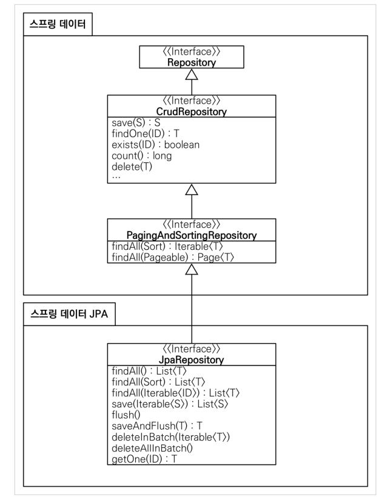
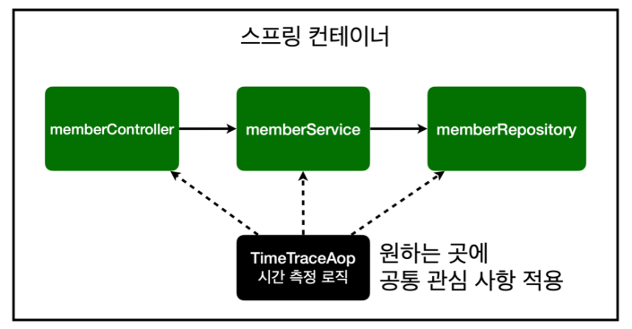
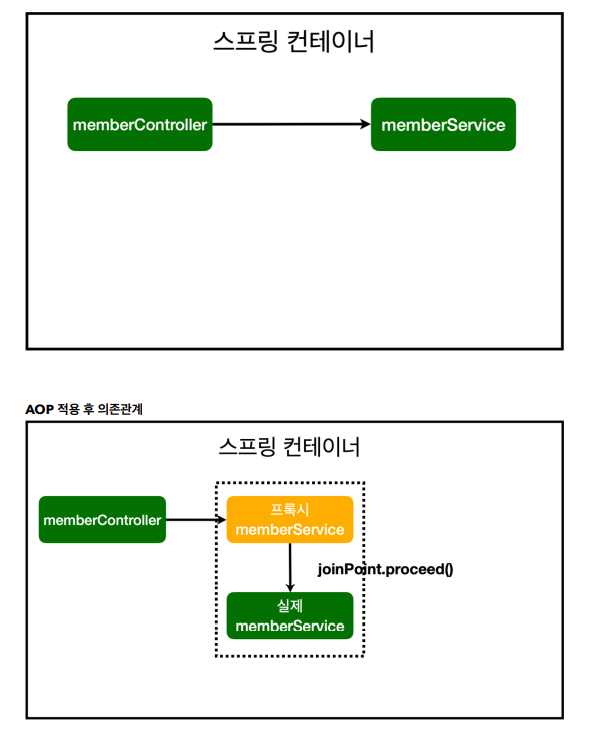
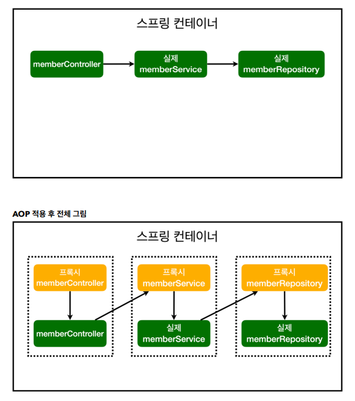

✍️ **TIL (2023-01-14)**
===  

</br>

## **1. JPA**
- JPA는 기존의 반복 코드는 물론이고, 기본적인 SQL도 JPA가 직접 만들어서 실행해준다.  
- JPA를 사용하면, SQL과 데이터 중심의 설계에서 객체 중심의 설계로 패러다임을 전환을 할 수 있다.  
- JPA를 사용하면 개발 생산성을 크게 높일 수 있다. (SQL 쿼리도 JPA가 자동으로 처리해준다.)  

</br>

- `build.gradle` 파일에 JPA, h2 데이터베이스 관련 라이브러리 추가  
('`...-data-jpa`' 라이브러리에 '`jdbc`'와 관련된 라이브러리도 포함되어 있다.)
    ```gradle
    dependencies {
        implementation 'org.springframework.boot:spring-boot-starter-thymeleaf'
        implementation 'org.springframework.boot:spring-boot-starter-web'
        // implementation 'org.springframework.boot:spring-boot-starter-jdbc'
        implementation 'org.springframework.boot:spring-boot-starter-data-jpa'
        runtimeOnly 'com.h2database:h2'
        testImplementation('org.springframework.boot:spring-boot-starter-test') {
            exclude group: 'org.junit.vintage', module: 'junit-vintage-engine'
        }
    }
    ```  
- 스프링 부트에 JPA 관련 설정 추가  
    - `spring.jpa.show-sql=true` : JPA가 생성하는 쿼리를 출력한다.
    - `spring.jpa.hibernate.ddl-auto=create` : `create`으로 설정하면 엔티티 정보를 바탕으로 자동으로 TABLE을 만들어 준다.
    ```properties
    spring.datasource.url=jdbc:h2:tcp://localhost/~/test
    spring.datasource.driver-class-name=org.h2.Driver
    spring.datasource.username=sa
    spring.jpa.show-sql=true
    spring.jpa.hibernate.ddl-auto=none
    ```  
- JPA는 인터페이스 (자바 진영의 표준 인터페이스)이고, 이를 구현한 구현체로는 Hibernate, EclipseLink (오픈 소스) 등이 있다. 
- JPA는 자바 진영에서 ORM(Object-Relational Mapping) 기술 표준으로 사용되는 인터페이스의 모음이다.
    - **ORM (Object-Relational Mapping)** : 자바의 객체를 RDB의 데이터로 자동으로 매핑해주는 기술  
    - 이러한 매핑은 어노테이션을 통해 할 수 있다.

</br>

- JPA 엔티티 매핑
    ```java
    package hello.hellospring.domain;

    import jakarta.persistence.Entity;
    import jakarta.persistence.GeneratedValue;
    import jakarta.persistence.GenerationType;
    import jakarta.persistence.Id;

    @Entity
    public class Member {

        // '@Id' 어노테이션으로 TABLE의 PK를 설정해 준다.
        // DB에 데이터를 넣을 때 DB가 자동으로 id를 생성해주는 것을 Identity 전략이라고 한다.
        @Id @GeneratedValue(strategy = GenerationType.IDENTITY)
        private Long id;
        private String name;

        public Long getId() {
            return id;
        }

        public void setId(Long id) {
            this.id = id;
        }

        public String getName() {
            return name;
        }

        public void setName(String name) {
            this.name = name;
        }
    }
    ```  
- JPA 회원 리포지토리
    ```java
    package hello.hellospring.repository;

    import hello.hellospring.domain.Member;
    import jakarta.persistence.EntityManager;

    import java.util.List;
    import java.util.Optional;


    public class JpaMemberRepository implements MemberRepository{

        // '...-data-jpa' 라이브러리를 사용할 경우 스프링 부트가 자동으로 EntityManager를 만들어 준다. → DI 받는다!
        private final EntityManager em;

        public JpaMemberRepository(EntityManager em) {
            this.em = em;
        }

        @Override
        public Member save(Member member) {
            em.persist(member);
            return member;
        }

        @Override
        public Optional<Member> findById(Long id) {
            Member member = em.find(Member.class, id);
            return Optional.ofNullable(member);
        }

        @Override
        public Optional<Member> findByName(String name) {
            List<Member> result = em.createQuery("select m from Member m where m.name = :name", Member.class)
                    .setParameter("name", name)
                    .getResultList();
            return result.stream().findAny();
        }

        @Override
        public List<Member> findAll() {
            // JPQL이라는 쿼리 언어. PK를 사용하지 않는 쿼리인 경우 작성해야 한다.
            // 아래의 쿼리에선 'm'을 통해 멤버 자체를 select 한다.
            List<Member> result = em.createQuery("select m from Member m", Member.class)
                    .getResultList();
            return result;
        }
    }
    ```  
- 서비스 계층에 `@Transactional` 어노테이션 추가
    ```java
    import org.springframework.transaction.annotation.Transactional;

    @Transactional  // JPA를 사용하려면 항상 Transaction이 있어야 한다.
    public class MemberService {
        // ...
    }
    ```  
    - 스프링은 해당 클래스의 메서드를 실행할 때 트랜잭션을 시작하고, 메서드가 정상 종료되면 트랜잭션을 커밋한다.  
    (만약 런타임 예외가 발생하면 롤백한다.)  
    - JPA를 통한 모든 데이터 변경은 트랜잭션 안에서 실행해야 한다.  

</br>

## **2. 스프링 데이터 JPA**  
- 스프링 부트와 JPA만 사용해도 개발 생산성이 정말 많이 증가하고, 개발해야할 코드도 확연히 줄어든다.  
- 여기에 스프링 데이터 JPA를 사용하면, 레포지토리에 구현 클래스 없이 인터페이스 만으로 개발을 완료할 수 있게 된다. 
- 반복 개발해온 기본 CRUD 기능 또한 스프링 데이터 JPA가 모두 제공해준다.
- 스프링 부트와 JPA라는 기반 위에, 스프링 데이터 JPA 프레임워크를 사용함으로써 핵심 비즈니스 로직을 개발하는 데 집중할 수 있다.  

</br>

- 스프링 데이터 JPA 회원 레포지토리 생성
    ```java
    package hello.hellospring.repository;

    import hello.hellospring.domain.Member;
    import org.springframework.data.jpa.repository.JpaRepository;

    import java.util.Optional;

    // 인터페이스만 있어도 JpaRepository를 Extend 한다면 스프링 데이터 JPA가 구현체를 만들어 스프링 빈에 자동으로 등록해준다.
    public interface SpringDataJpaMemberRepository extends JpaRepository<Member, Long>, MemberRepository {
        @Override
        Optional<Member> findByName(String name);
    }
    ```  
- 스프링 데이터 JPA 회원 리포지토리를 사용하도록 스프링 설정 변경  
    ```java
    package hello.hellospring.service;

    import hello.hellospring.repository.*;
    import org.springframework.beans.factory.annotation.Autowired;
    import org.springframework.context.annotation.Bean;
    import org.springframework.context.annotation.Configuration;

    @Configuration
    public class SpringConfig {

        private final MemberRepository memberRepository;

        // DI 받으면 스프링 데이터 JPA가 만들어 놓은 구현체가 등록된다.
        @Autowired
        public SpringConfig(MemberRepository memberRepository) {
            this.memberRepository = memberRepository;
        }

        @Bean
        public MemberService memberService() {
            return new MemberService(memberRepository);
        }

    //    @Bean
    //    public MemberRepository memberRepository() {
    //        return new MemoryMemberRepository();
    //        return new JdbcMemberRepository(dataSource);
    //        return new JdbcTemplateMemberRepository(dataSource);
    //        return new JpaMemberRepository(em);
    //    }
    }
    ```
- 스프링 데이터 JPA가 `SpringDataJpaMemberRepository` 를 스프링 빈으로 자동 등록해준다.  

</br>

- 스프링 데이터 JPA 제공 클래스  
  

</br>

- 스프링 데이터 JPA 제공 기능
    - 인터페이스를 통한 기본적인 CRUD
    - findByName() , findByEmail() 처럼 메서드 이름 만으로 조회 기능 제공
    - 페이징 기능 자동 제공  

> 참고 )  
실무에서는 JPA와 스프링 데이터 JPA를 기본으로 사용하고, 복잡한 동적 쿼리는 Querydsl이라는 라이브러리를 사용하면 된다.  
Querydsl을 사용하면 쿼리도 자바 코드로 안전하게 작성할 수 있고, 동적 쿼리도 편리하게 작성할 수 있다.  
이 조합으로 해결하기 어려운 쿼리는 JPA가 제공하는 네이티브 쿼리를 사용하거나, 앞서 학습한 스프링 JdbcTemplate를 사용한다.  

</br>

## **3. AOP** 
- AOP가 필요한 상황
- 모든 메소드의 호출 시간을 측정하고 싶다면?
- 공통 관심 사항(cross-cutting concern) vs 핵심 관심 사항(core concern)
- 회원 가입 시간, 회원 조회 시간을 측정하고 싶다면? 

</br>

- MemberService 회원 조회 시간 측정 추가
    ```java
    package hello.hellospring.service;

    import hello.hellospring.domain.Member;
    import hello.hellospring.repository.MemberRepository;
    import org.springframework.transaction.annotation.Transactional;
    import java.util.List;
    import java.util.Optional;

    @Transactional
    public class MemberService {

        private final MemberRepository memberRepository;

        public MemberService(MemberRepository memberRepository) {
            this.memberRepository = memberRepository;
        }

        /**
        * 회원가입
        */
        public Long join(Member member) {
            long start = System.currentTimeMillis();
            try {
                validateDuplicateMember(member); //중복 회원 검증
                memberRepository.save(member);
                return member.getId();
            } finally {
                long finish = System.currentTimeMillis();
                long timeMs = finish - start;
                System.out.println("join " + timeMs + "ms");
            }
        }

        /**
        * 중복 회원 가입 여부 확인
        */
        private void validateDuplicateMember(Member member) {
            memberRepository.findByName(member.getName())
                    .ifPresent(m -> {
                        throw new IllegalStateException("이미 존재하는 회원입니다.");
                    });
        }

        /**
        * 전체 회원 조회
        */
        public List<Member> findMembers() {
            long start = System.currentTimeMillis();
            try {
                return memberRepository.findAll();
            } finally {
                long finish = System.currentTimeMillis();
                long timeMs = finish - start;
                System.out.println("findMembers " + timeMs + "ms");
            }
        }
        /**
        * 특정 회원 조회
        */
        public Optional<Member> findOne(Long memberId) {
            return memberRepository.findById(memberId);
        }
    }
    ```  

</br>

- 문제
    - 회원가입, 회원 조회에 시간을 측정하는 기능은 핵심 관심 사항이 아니다.
    - 시간을 측정하는 로직은 공통 관심 사항이다.
    - 시간을 측정하는 로직과 핵심 비즈니스의 로직이 섞여서 유지보수가 어렵다.
    - 시간을 측정하는 로직을 별도의 공통 로직으로 만들기 매우 어렵다.
    - 시간을 측정하는 로직을 변경할 때 모든 로직을 찾아가면서 변경해야 한다.  

</br>

## **4. AOP 적용**  
- **AOP** : Aspect Oriented Programming
- 공통 관심 사항(cross-cutting concern)과 핵심 관심 사항(core concern)을 분리한다.  
  

</br>

- 시간 측정 AOP 등록
    ```java
    package hello.hellospring.aop;

    import org.aspectj.lang.ProceedingJoinPoint;
    import org.aspectj.lang.annotation.Around;
    import org.aspectj.lang.annotation.Aspect;
    import org.springframework.stereotype.Component;

    @Component
    @Aspect
    public class TimeTraceAop {

        @Around("execution(* hello.hellospring..*(..))")  // hellospring 하위 패키지에 모두 적용한다.
        public Object execute(ProceedingJoinPoint joinPoint) throws Throwable {
            long start = System.currentTimeMillis();
            System.out.println("START: " + joinPoint.toString());
            try {
                Object result = joinPoint.proceed();
                return result;
            } finally {
                long finish = System.currentTimeMillis();
                long timeMs = finish - start;
                System.out.println("END: " + joinPoint.toString() + " " + timeMs + "ms");
            }
        }
    }
    ```  

- 문제 해결
    - 회원 가입, 회원 조회 등 핵심 관심 사항과 시간을 측정하는 공통 관심 사항을 분리한다.  
    - 시간을 측정하는 로직을 별도의 공통 로직으로 만들었다.  
    - 핵심 관심 사항을 깔끔하게 유지할 수 있다.  
    - 변경이 필요하면 이 로직만 변경하면 된다.  
    - 원하는 적용 대상을 선택할 수 있다.  

</br>

- 스프링의 AOP 동작 방식  
  
  
